```{r setup, include=FALSE}
knitr::opts_chunk$set(echo = FALSE)
```

# The Data Visualisation

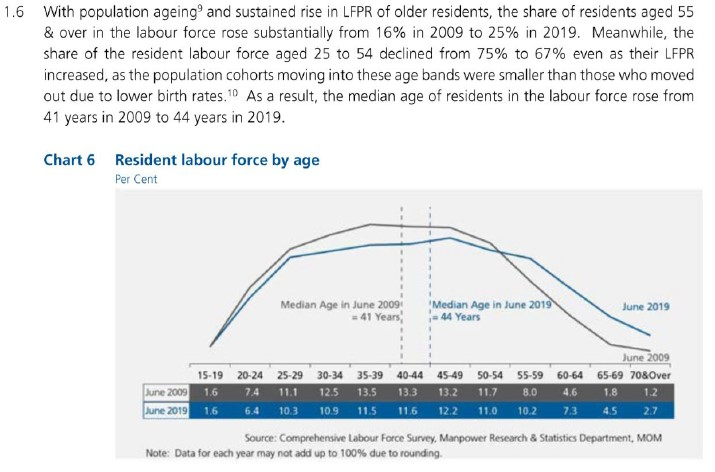

# (a) Critique of current visualisation

## Clarity

### 1. No proper labelling of graph axes and units used in table

The visualisation has a chart title and sub-title to inform the audience that the graph shows data on resident labour force by age and the units are in per cent. However, the graph itself does not have the y-axis or its title or label, which lets the audience wonder what is the y-axis measure if one misses the small print of the chart sub-title. 

The x-axis should be have a title to indicate that the data is grouped into age bands. The positioning of the x-axis just above the table values also created some confusion pertaining to the unit measure of the x-axis and y-axis. Therefore, in this visualisation, it is important to have proper axis titles and unit measures.

### 2. Intended message not clearly conveyed by visualisation

Looking at the visual alone (both graph and table), the message focus seems to be on the **spread across the different age bands** for the years 2009 and 2019, with two reference lines indicating the median age for each aforementioned year. The lead-in statements provide more information and numbers, and possible explanations for the **shift in share of the resident labour force**, which resulted in the increase in median age between 2009 and 2019. The lead-in statements further grouped the age bands ("aged 55 & over", "aged 25 to 54") in its description, which is inconsistent with the graph display. There is also mention of the Labour Force Participation Rate (LFPR) and its possible relationship with the labour force age, which is not reflected in the visualisation.

With reference to the [original report](https://stats.mom.gov.sg/Pages/Labour-Force-In-Singapore-2019.aspx) on page 22, the entire visualisation and lead-in statements served to describe the trend that there are "more older residents in the labour force". This message is not clearly conveyed by the visualisation and is only explicitly mentioned at the end of the lead-in statements.

When put together, the audience is overwhelmed by the information provided in the lead-in statements and underwhelmed by the graph with no annotations to highlight the trends. Effective visualisations should work the other way round, where the lead-in statements should set the context and background succinctly, and the visualisation should convey the data and the intended message in a concise manner.

### 3. Use of line chart with categorical data plotted on the x-axis

Line charts are frequently used to display time-series data, with the time factor plotted on the x-axis. In this visualisation, data is plotted for two time periods (2009 and 2019) but are represented as two series on the chart area instead, with the age band categories indicated on the x-axis. The use of wrong chart type led to some initial confusion on what the graph is trying to convey.

### 4. Labour force age patterns between 2009 and 2019 were not shown

The data for the years between 2009 and 2019 were not plotted on the graph, which diminishes the clarity of the visualisation. Questions on the integrity of the visualisation may also arise, such as whether the visualisation is trying to show what it wants the audience to see, or to hide certain trends that happened during those missing years.

### 5. Data source and note on data values included in the visualisation

Indicating the data source gives credibility to the visualisation and allows the audience to look into the data source in more detail. Adding a note to explain the rounding implication on summation of percentages is helpful to avoid questions from the more meticulous and detailed audience. The note also hinted that the data values shown are in percentages. The aesthetics could be further improved by aligning the two lines of text.

## Aesthetics

### 1. Clear differentiation between data lines and reference lines

The audience is able to quickly differentiate the data from the reference lines, as the data is made more obvious by using thicker lines and the reference lines are thinner and dotted. 

### 2. Well-placed labels on visualisation allows audience to identify groups of data

The visualisation has well-placed labels to differentiate between 2009 and 2019 for each data visualisation, namely the line graphs, reference lines and table values. This eliminated the need for a legend as the audience can immediately know the year represented by which line. In addition, the label for the median reference line included the median value, giving the audience the information upfront without having the need to trace the reference line to the x-axis to look for the median age.

The labels can be further improved by removing the word "June", as the intended message is concerned with the age over a longer period of time (in years), and does not require the exact month that the data is based on.

### 3. Consistent use of colours allows audience to distinguish groups of data

The visualisation defined a unique mapping between the data for each year and colour (grey for June 2009; blue for June 2019). This colour scheme is used consistently across the line graphs, reference lines and table, which makes it easier for the audience to locate and make comparisons in the visualisation. The colour palette used is kept simple, which makes the design of the visualisation clean and pleasant to look at.

### 4. Use of background colour to highlight different parts of the visualisation

The change in background colour allows the audience to identify different parts of the visualisation. The audience is able to quickly see that the line graph elements are on the light grey background, whereas the table elements are on a dark-coloured background.

There is good contrast between the line graph and table. However, the attention of the audience is drawn to the table due to its darker colours. The background colour of the table can be improved by using lighter shades.

# (b) Proposed design


The proposed design attempts to convey the message that there are more older residents in the labour force more visually, while upholding the visualisation principles and best practices. The advantages of the proposed design are as follows:

- Information in the original lead-in statements are represented graphically as much as possible, thus reducing the amount of text in the lead-in statements.
- Time factor is plotted on the x-axis with the appropriate use of stacked bar charts to visually differentiate between age bands.
- As there are 12 age bands, logical grouping of age bands according to Singapore's context helps to reduce the complexity of the visualisation and provide relevance to the Singaporean audience.
- Labour force age patterns for the entire time period from 2009 and 2019 are shown, providing a more complete story behind the data.
- Use of annotation to highlight and accentuate the intended message.

# (c) Final product of proposed visualisation

The proposed visualisation is designed using Tableau and uploaded on Tableau Public. The link can be found [here](https://public.tableau.com/views/DataViz_Makeover_01_Tableau/Dashboard1?:language=en-GB&:display_count=y&:origin=viz_share_link).

# (d) Step-by-step description to prepare the final product

## 1. Verify data source of original visualisation

Raw data for number of residents by age bands and median age from 2009 to 2019 were found in two separate Excel files, renamed to T7 and T2 respectively. It was noted that there are multiple worksheets in T7, showing the overall number of residents by age bands and by sex.

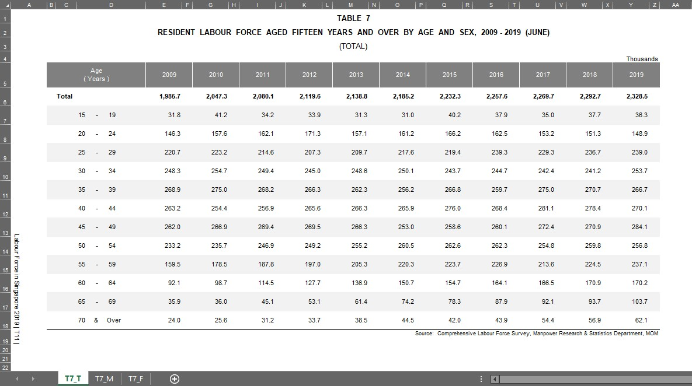 


    
## 2. Import relevant data tables into Tableau

The two Excel files were imported as separate data sources, shown in the figure below.


The table containing the overall number of residents is found in T7_T worksheet. Both tables T7_T and T2 were connected as table datas in Tableau.

## 3. Prepare and clean the data

Many null values were detected by Tableau after import, as the data tables in the Excel files were formatted for easy reading and reporting. The figure below shows T7_T after importing in Tableau.

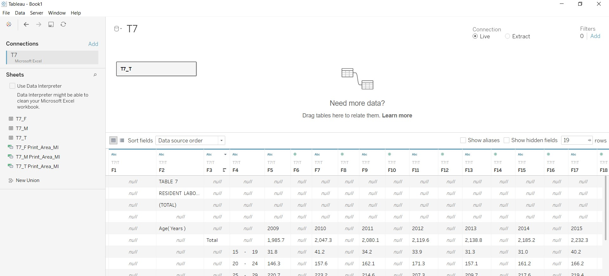

The Tableau function Data Interpreter was used for the initial data cleaning. The figures below show the resulting tables after using Data Interpreter.

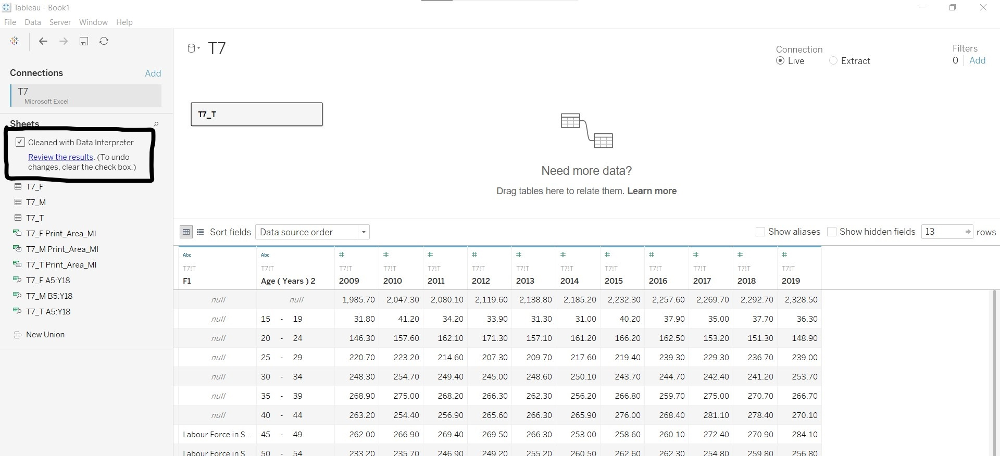 

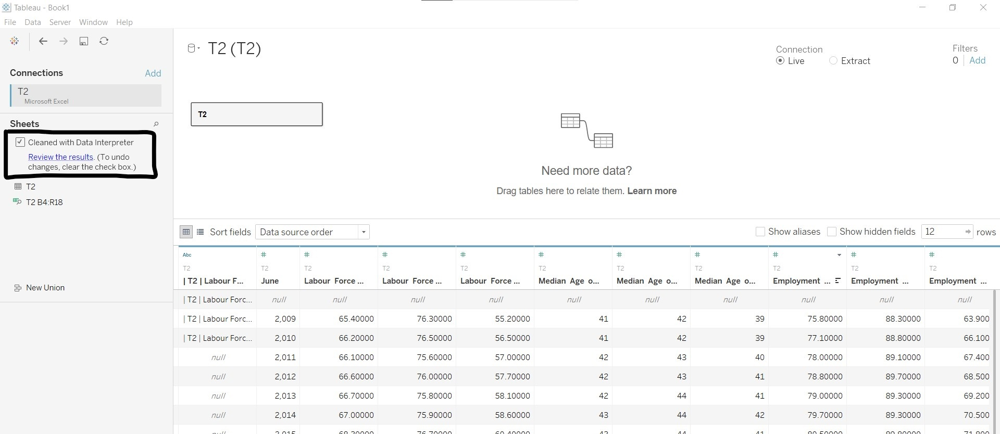

The table below shows the changes made to the respective tables:

For T7_T | For T2
---------|---------
Hid column *F1*                                | Hid all other columns except for *Labour Force Participation Rate (%)* and *Median Age of Labour Force (Years)*
Renamed *Age (Years) 2* to *Age_band*          | Renamed *June* to *Year* and changed the data type to "Date"
Pivoted columns containing years               | Renamed *Labour Force Participation Rate (%)* to *LFPR (%)*
Renamed *Pivot Field Names* to *Year* and changed the data type to "Date" | Renamed *Median Age of Labour Force (Years)* to *Median Age (Years)*
Renamed *Pivot Field Values* to *No_residents* |Added filter to remove empty rows
Added filter to remove the Total across age bands (null values under *Age_band*) |

Labour Force Participation Rate was retained in the data table as it was mentioned in the original visualisation. The use of the data would be explored in later steps.

The figures below show the cleaned versions of the two data tables.

 


## 4. Create the stacked bar graph

The following steps were taken to create the stacked bar graph:
- Using T7_T data, drag *Year* to "Columns", *Age_band* and *No_residents* to "Rows".
- Click on "Show Me" and select the stacked bar chart option.

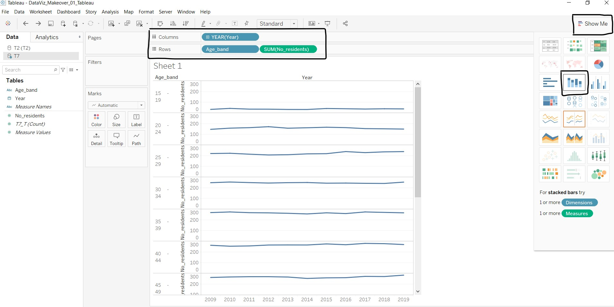

- Under *SUM(No_residents)* dropdown list, select "Quick Table Calculations" - "Percent of Total", and under the same dropdown list, select "Compute Using" - "Age_band".

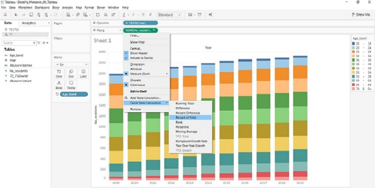

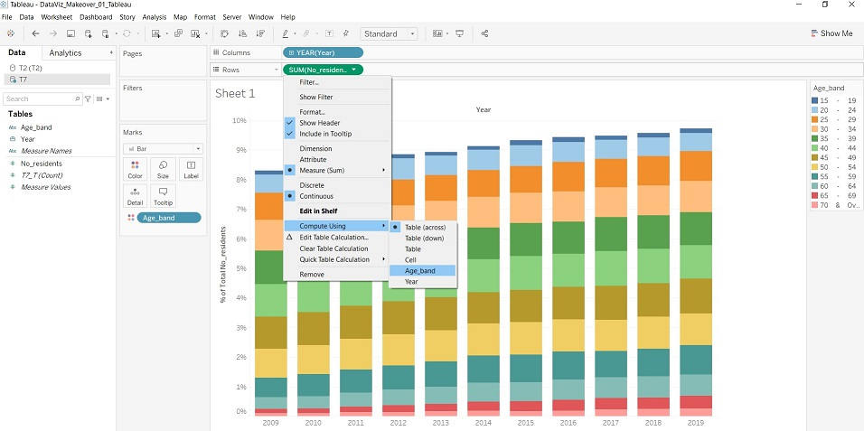

- At the legend, select "15 - 19" and "20 - 24", right-click and select "Group". A new measure *Age_band (group)* appears under the data list.


- Right-click the measure *Age_band (group)* and select "Edit Group...".


- At the pop-up window, create two other groups for ages between 25 to 54 and 55 and above.

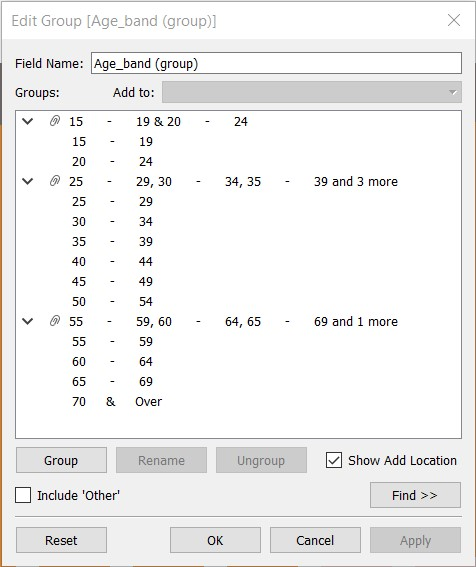

- Rename the groups created to reflect the start and end ages.
- Sort the *Age_band (group)* in descending order, as human perception of increasing trend is from down to up.


## 5. Add the median age line to the graph

The following steps were taken to add the median age line to the stacked bar graph:
- Go to "T2 (T2)" under the data list, select *Median Age (Years)* and drag to the right side of the graph.
- Under Marks card, *SUM(Median Age (Years))* sub-card, change the display from "Bar" to "Line".

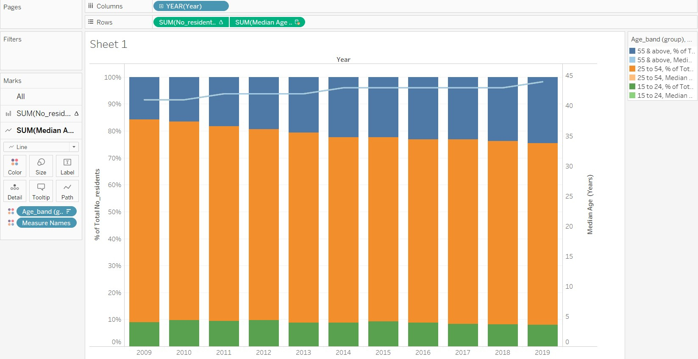

- Remove the *Age_band (group)* and *Measure Names* from the *SUM(Median Age (Years))* sub-card.
- Edit the axis and change the range to "Fixed" from 0 to 80. This is to bring the line down to within the 25 to 54 age band group to give a more accurate picture of the data. The number 80 was chosen arbitrary to represent the age of the oldest resident in the labour force, which does not fall far from the truth.


## 6. Add meaning to the graph

With the base graph, the next step would be to add meaning to the graph through aesthetics. The following changes are made in the Sheet view:

- The colour palette of the stacked bar graph was changed to show a single-colour gradient over the three groups, so that the shift in trend is more obvious. The darker end of the colour gradient is chosen to represent older age bands, so that the attention is brought to that group.


- The colour of the *Median Age (Year)* line was edited and markers were added. However, as the markers for the line chart are too small (unable to change the size due to limitations in the software), the display was changed from "Line" to "Circle" instead. The overall effect is better when labels and trend line were added.


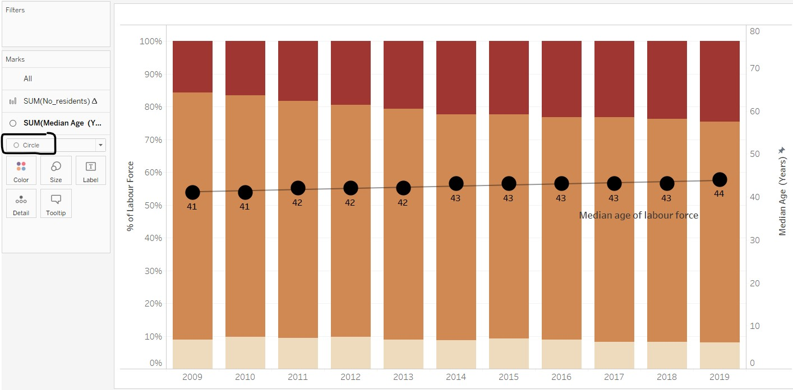

- Titles and labels were edited for layman understanding.
- Data source and note on the summation of percentages were added as part of the graph caption.
- Annotation for points was added to highlight the increase and decline in share of residents for 55 and above and 25 to 54 groups respectively. Key words are in boldface and made larger to capture attention. As the Tableau annotation can only link to one point, another annotation for point was overlaid (with no fill and borders) to create an annotation that links to two points.


As the Sheet view of Tableau only catered for chart title, the title of the visualisation and lead-in statements were added to the visualisation using the Tableau Dashboard feature. The steps taken are as follows:
- The size of the dashboard is kept at a fixed size of 800 x 600 (laptop browser). This is to ensure that the position of the annotations do not change when it automatically resizes the visualisation.
- Title and a text object were added on the Dashboard view for the visualisation title and lead-in statement respectively.
- The caption was 
- As the location of the legend was too near the top, a blank object was added to bring the legend closer to the part of the graph where the two age groups meet.
- The caption created from the Sheet view was explicitly made to show on the Dashboard view.

A screen capture of the final product in Tableau Dashboard is shown below.


# (e) Major observations revealed by the final product

The message of the visualisation is clearly shown from the title and a brief lead-in statement shares on the possible factors that caused the increase in older residents in the labour force. The annotations highlight key points revealed by the graph, which supports the message.

Besides conveying the original intended message, other major observations can also be made from the final proposed visualisation:

## 1. Rate of change of percentage of labour force by age groups and median age of labour force

While the increase in median age seems gradual (median age stayed at 43 from 2014 to 2018), the increase in the percentage of older residents in the labour force seems to be at a faster pace over the same period of time. The graph also seems to hint that the median age could increase and fall within the 55 & above age group in the next 10 to 20 years. This has implications on government policy planning and also for corporate organisations in planning for an older employee population.

## 2. Proportion of labour force by age groups over time

From the final product, it is visually more prominent that the percentage of labour force in the 15 to 24 age group is rather constant and hovers around 10%, and that there is an obvious shift of the proportion from the 25 to 54 age group to the 55 & above age group. This causes concern and may trigger authorities to think of ways to increase the labour force aged 24 and below.

## 3. More questions!

Based on the above two observations, more questions on the linkage between labour force, working population, unemployment rates and birth rates surfaced. Some of these are identified in the lead-in statement as factors that may have an impact on the resident labour force and the median age. The audience may be curious as to what exactly is the relationship and pattern of these other factors. As this dataviz is focused on re-visualising the current message, the additional data is not included in the proposed visualisation. It would be more informative if the data of the aforementioned factors can be placed in the same view (as a dashboard) to give a more accurate and complete picture of the trends in the Singapore labour force.
