```{r setup, include=FALSE}
knitr::opts_chunk$set(echo = FALSE)
```

# The Data Visualisation

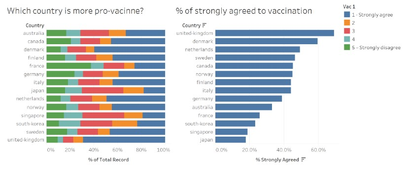{width=120%}

# (a) Critique of current visualisation

## Clarity

### 1. Layout of the graph elements in the visualisation

The graph titles are obvious and the audience is able to visually group the title with the corresponding graph. However, it is not clear if the title "Which country is more pro-vacinne?" is intended for the graph on the left only or for both graphs, as the title seems broad and could be applicable to both graphs (side note: vaccine is misspelt in the title).

The placement of the legend should be beside the graph (on the left) that the audience need to reference to more often, so that it is clear to the audience the colour encoding of the graph, and also to reduce the distance that the audience needs to visually trace between the graph and the legend.

### 2. Partial colour encoding indicated in the legend

The legend only indicated the levels (i.e. 1 and 5) with a short description for the first and last colours, and only the levels (i.e. 2, 3 and 4) for the middle three colours. To make it clear to the audience what each colour stands for, and for consistency, the short description should be added for the middle three colours as well. It is noted that the data source did not include the short description for the middle values.

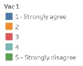{width=35%}

In addition, the title of the legend "*Vac 1*" does not convey clearly what the legend is for.

### 3. Misleading graph title for the data in the graph on the left

At a cursory glance, the audience is led to think that there are two different messages being conveyed in the data visualisation due to (a) the wording of the titles; and (b) more categories being observed in the graph on the left (made more visually prominent by differences in the colours used in the two graphs).

Upon a closer look, the data in the graph on the left is based on the categories of a 5-point Likert scale. Comparing with the graph on the right, the audience then realises that the blue bars match for the two graphs. As the graph on the right clearly states that the data reflects the "% of strongly agreed to vaccination", this suggests that the graph on the left is based on the full spectrum of responses answering the same question on vaccination for each country. Here, the creator assumed that the indicator of a country being "pro-vaccine" is represented by the percentage of survey respondents who agreed or disagreed to vaccination, and misleads the audience to think this way too.

### 4. Graph title not useful for the graph on the right

The visualisation is based on a survey on the willingness of the public on Covid-19 vaccination, and the data on the field "*vac_1: If a Covid-19 vaccine were made available to me this week, I would definitely get it:*" is used to plot the graphs. Although the graph title indicates that the visualisation is showing the "% of strongly agreed to vaccination", it is not clear to the audience that the vaccination is for Covid-19 and not other viruses.

In addition, there are several variations to the question asked in *vac_1* with the same values, in the survey, which is shown in the table below:

Field|Question
-----|--------
vac_1|If a Covid-19 vaccine were made available to me this week, I would definitely get it:
vac_2|If a Covid-19 vaccine becomes available to me in 2021, I definitely intend to get it.
vac_3|If a Covid-19 vaccine becomes available to me a year from now, I definitely intend to get it

For someone who knows the survey and the questions asked, it is not clear which question's data is the visualisation based on. Even if the small print "*Vac 1*" in the legend is noted, it will require some work on the part of the audience to try to remember or to find out what it means, which defeats the purpose of visualisations in facilitating analytical reasoning. 

### 5. Selection of countries not explained in the visualisation

The creator selected 14 out of the 30 countries surveyed to include in the visualisation. The reasons for the choice of countries are not included in the visualisation and may mislead the audience to think that the 14 countries shown are either the only countries that were surveyed or the top-14 countries that have the highest percentage of strongly agreed to vaccination. It was also noted that prominent countries like China and United States were missing in the visualisation.

Upon further investigation of the dataset, it was found that the remaining countries (Brazil, China, Hong Kong, India, Indonesia, Malaysia, Mexico, Philippines, Saudi Arabia, Taiwan, Thailand, United Arab Emirates, United States and Vietnam) do not have the vaccination fields in the dataset, and the data from Israel is recently added from 29/01/2021 onwards. These were likely the reasons for the exclusion in the visualisation, which the creator did not attempt to explain to provide clarity.

In addition, Spain is excluded in the visualisation when valid data is available.

### 6. Good use of chart type and chart orientation

The use of the stacked bar chart on the left allows for meaningful comparison of the categories across countries, as well as within each country. Each bar is split into five categories, which is manageable for the audience to make moderately accurate visual comparisons. For both graphs, the x-axes start at zero, which gives a good representation and proportion of the percentage data shown.

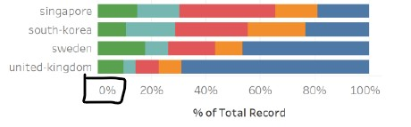{width=80%}


The charts are placed horizontally, instead of vertically, which allows the audience to easily read the country labels.

### 7. Data ordered differently in both graphs

The two graphs are ordered differently, left in alphabetic order of the country name and right in descending data value order. Assuming that the intent of the graph on the right is for the audience to have a detailed view of the percentage values (which is difficult to read from the stacked bar graph on the left), the difference in the ordering makes it challenging to find a specific country in the graph on the right. For example, if I am interested in France after looking at her distribution of responses in the graph on the left, I need to scan through the list of countries in the graph on the right to find France. This "eye-balling" action (left-right, up-down) also makes it more tedious for comparisons between multiple countries.

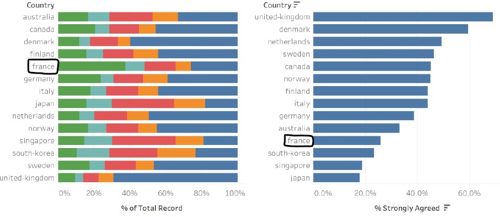

The intent of the creator is to show each country's percentage of survey respondents who agreed or disagreed to vaccination, in an attempt to link it to how "pro-vaccine" a country is. As the order of the data in the graph on the left is in alphabetic order, it is visually challenging to see which country has the highest or lowest percentage for the different categories. On the other hand, the graph on the right is ordered in descending data values, which makes it clear which country has the highest or lowest "% strongly agreed to vaccination".

As there are five categories that the data values ordering can be based on, the one that best conveys the intended message should be chosen. This will allow the audience to clearly see the message intended by the creator, and also make better comparisons within and across countries.

### 8. Graph on right part of a replicate of graph on the left

As the % strongly agreed from the graph on the left is extracted and displayed in the graph on the right, there is no new information to be gained from the graph on the right if the graph on the left is ordered in the same way. It is also not clear that the two graphs are linked and how they are linked.

### 9. No information provided on dataset used

The data source is not indicated in the visualisation, thus reducing the clarity on which dataset the visualisation is based on as there are many similar surveys conducted. The audience is not able to look deeper or clarify any doubts that they might have without knowing the dataset used.

The period of the data used is also not provided in the visualisation. This is important to give the audience the timeframe that the visualisation is based on, given that the Covid-19 situation is highly dynamic and is constantly evolving. Developments on the global and local disease threat, and vaccine development and procurement by individual countries would have an impact on the willingness of the public on the Covid-19 vaccination. Therefore the period that the data is based on is important to give the audience clarity on the situational context.

## Aesthetics

### 1. Choice of colour scale used

The creator used a qualitative colour scale to distinguish the categories of the five-point Likert Scale. As there is an intrinsic order to the categories, with "strongly agree" having a higher order than "agree", and there is a sense of value of positive ("strongly agree") and negative ("strongly disagree"), it would be more appropriate to utilise a diverging colour scale.

### 2. Good aspect ratio used in cartesian coordinate system

The aspect ratio used ensures that any important differences in the length of the bars are noticeable in both graphs.

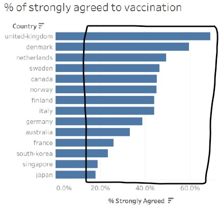{width=50%}

### 3. X-axis range and units

As mentioned earlier, both x-axes starts at zero, which makes the bar lengths proportional and representative of the percentage amount. However, the x-axis for the graph on the right should have a axis label after the longest bar, so that it does not give an impression of truncation.

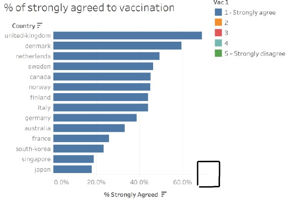

The x-axes titles and labels included the percentage units, which provides information to the audience on the units of the data. For consistency, the x-axis labels for both graphs should be aligned and rounded to the same decimal point, i.e. 20% or 20.0%.

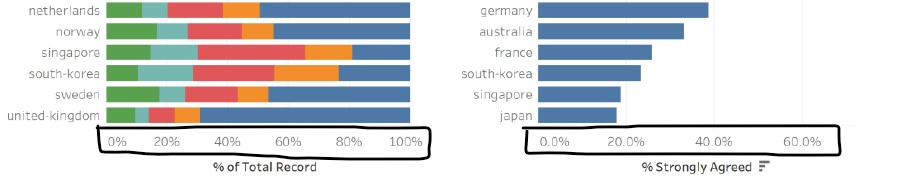

### 4. Axes labels are difficult to read

The x and y axes labels for both graphs are consistent and clear, but are difficult to read as the font colour is in a lighter tone. The attention of the audience is also drawn to the axes titles due to the boldface and darker colour. The effect would have been better if the font colour and boldface is swapped between the axes titles and labels, making it easier for the audience to find their countries of interest and the corresponding range that the bar lengths fall within.

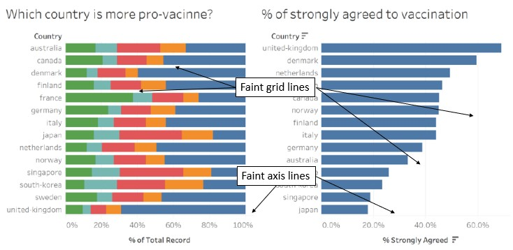

In addition, the x-axis lines and grid lines are faint and are hardly visible in both graphs. A slightly darker colour would make it visible without placing too much emphasis on it, allowing the audience to focus on the bars and be able to reference to the axes labels when needed.

# (b) Proposed design

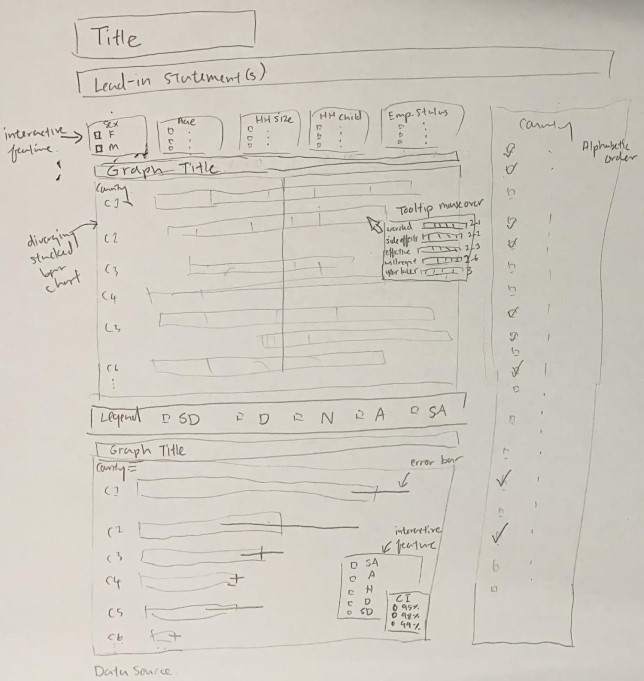

The proposed design consists of a number of components that attempt to address the issues highlighted above:

* **Visualiation title and lead-in statements**: highlight what the visualisation is about and provide some background information on the data e.g. period visualisation is based on
* **Interactive components**, namely being able to select parameters such as country, age, sex, household size, number of children in household, and employment status: allow exploration at the overall level while giving some flexibility to view the data of specific groups. Full range of countries to be provided, and to pre-set the country parameter to key countries so as not to over-crowd the initial visualisation
* **Top-and-bottom placement of graphs**: reduce the tendency to visually compare the two graphs
* **Legend placed between graphs**: reduce the distance of the legend from both graphs
* **Diverging stacked bar chart** with **diverging colour scale** for overview of data: accentuate the differences in the categories and aid in comparison of categories within each country and across countries
* **Tooltip mouseover** for each category to contain breakdown of other fields in the data: provide insights on the possible reasons for the category chosen for the diverging stacked bar chart
* **Horizontal bar chart with error bar** for zoomed-in view of each category: provide a sense of the dynamic Covid-19 situation by including error bars to show the ranges that responses may fluctuate within. Added interactivity for audience to select the category and confidence level for the error bars
* **Data source**: provide the link to the data source for easy access to the data used

The order for both graphs follows the original visualisation (alphabetic order for the diverging stacked bar chart and descending order for the horizontal bar chart with error bar). With the purpose of each graph to be explicitly included in the graph titles, there is no need to align the ordering as the purpose of the graphs is different.

# (c) Final product of proposed visualisation

The proposed visualisation is designed using Tableau and uploaded on Tableau Public. The link can be found [here]().

# (d) Step-by-step description to prepare the final product

### 1. Place all relevant csv files into one folder

Extract all zipped files and place all countries' csv files into the same folder. For countries with missing vaccination fields, they are placed in a sub-folder "missing_vac".

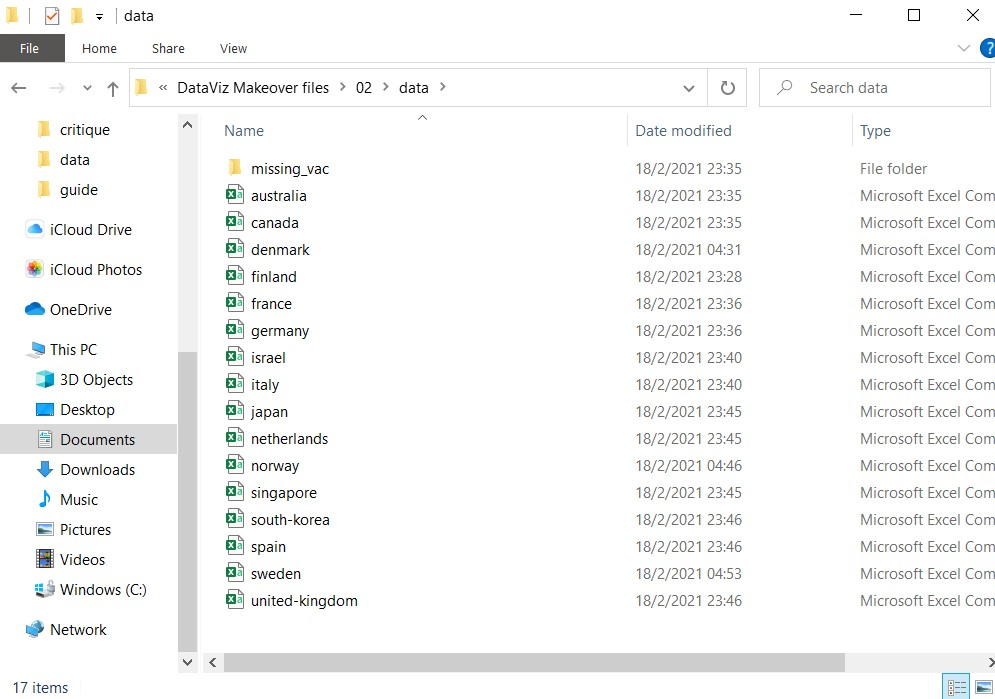

### 2. Prepare the data tables

For each file with valid vaccination fields, delete all other fields except for "RecordNo", "endtime", "gender", "age", "household_size", "household_children", "employment_status", "vac_1", "vac2_1", "vac2_2", "vac2_3", "vac2_6" and "vac_3". The order of the fields are aligned in all the files.

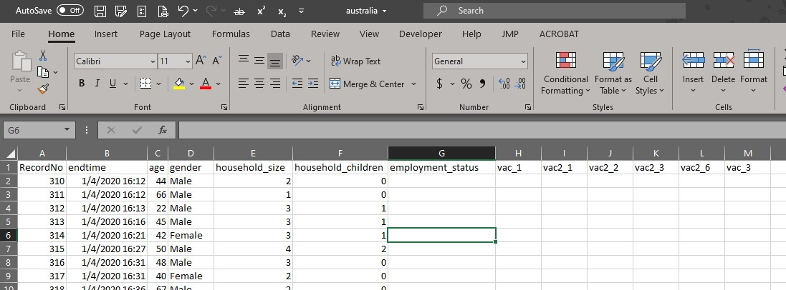

There is no household_size, household_children and employment_status in the Israel dataset. The three columns were added in for alignment with the rest of the files.

The employment_status are coded differently for four countries (Denmark, Finland, Norway and Sweden). Instead of one field, there are seven fields for each employment status value in binary (Yes/No).

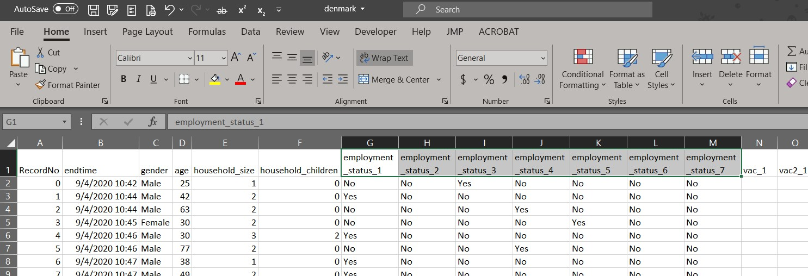

Recoding is done in Excel to replace "Yes" values under each employment_status column to reflect the employment status value to align with the other files. The mapping is as shown:

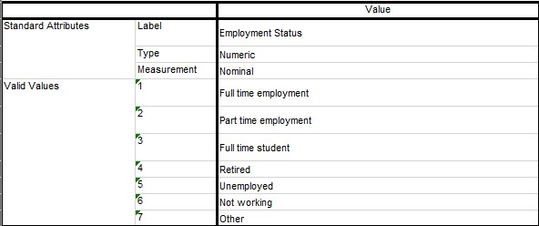

For each file, the steps taken in Excel are:

1. Select entire column "employment_status_1"
2. Press "Ctrl" + "F" to open the Find and Replace windowlet
3. Click on "Replace" tab
4. Under "Find what:" and "Replace with:", enter "Yes" and "Full time employment" respectively
5. Click "Replace All"

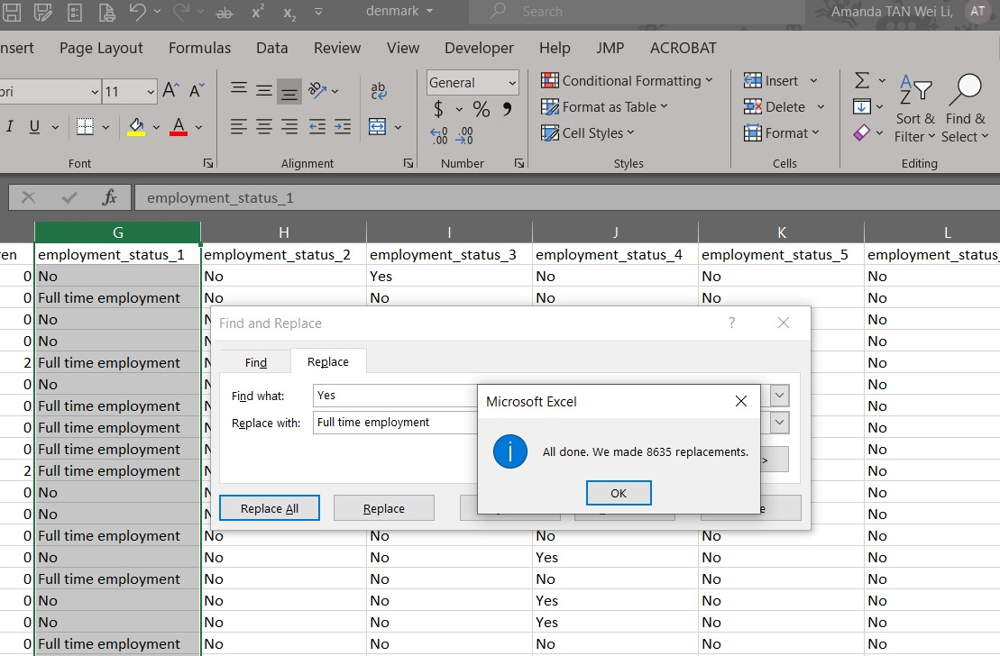

6. Repeat steps 1-5 to replace "No" values with blank
7. Repeat steps 1-6 for the remaining six columns
8. Save and close the file

The columns are then merged in Tableau and the data is exported to csv file, with the following steps for each file:

9. Open the file in Tableau
10. Select the columns to be merged
11. Right-click and select "Merge Mismatch Fields"

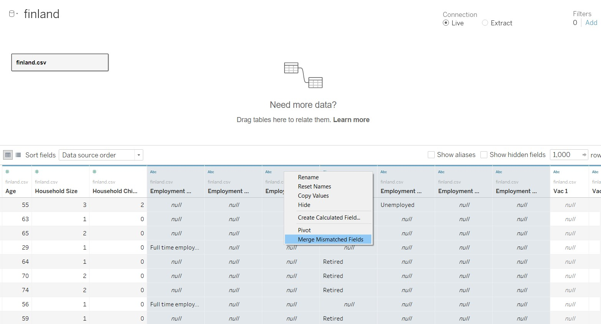

12. Rename the merged column created to "Employment Status"
13. At the menu bar, select Data/Export Data to CSV and click on the file name

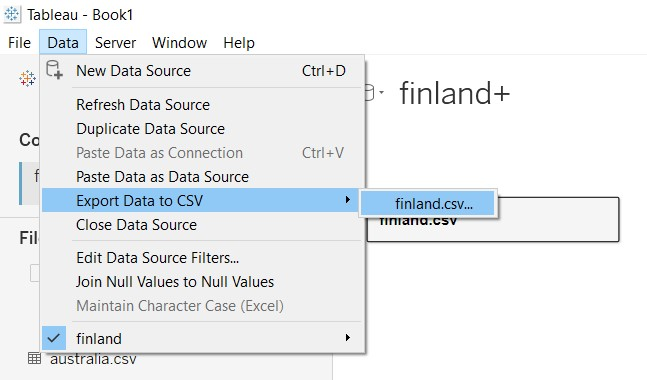

14. Save the file

As the order of the columns and field names in the exported data from Tableau changed, the columns are reordered and renamed in Excel to be the same as the other files.

### 3. Import data tables into Tableau

Open Tableau and click-and-drag (any) one file into Tableau.

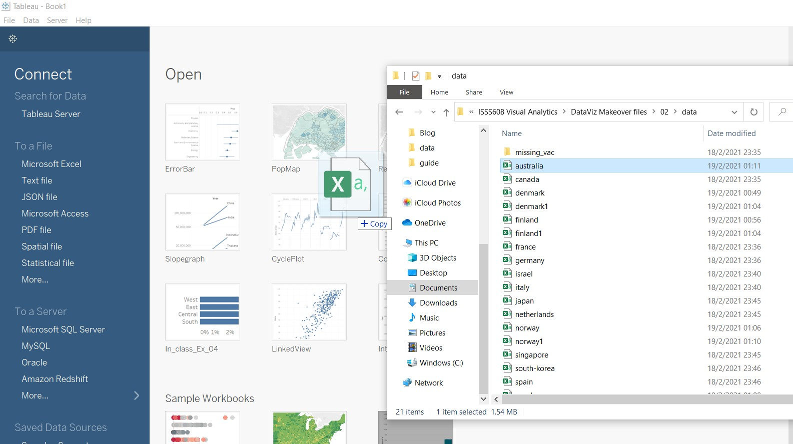

Tableau will automatically show all the other files in the same folder under "Files".

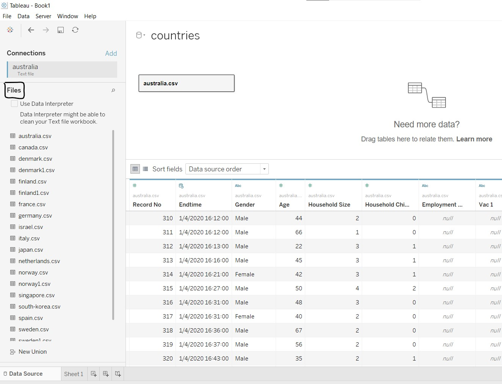

Remove "australia.csv" from the workspace by clicking and dragging it out of the workspace.

Under "Files", select all the relevant files and drag them into the workspace to combine all the data in the different files into one table.

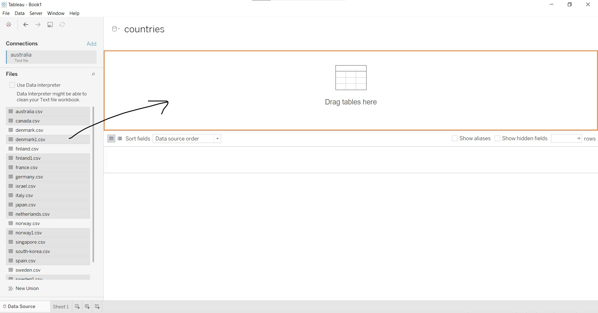

After combining, some repeated fields are noted, as indicated in the black box below.

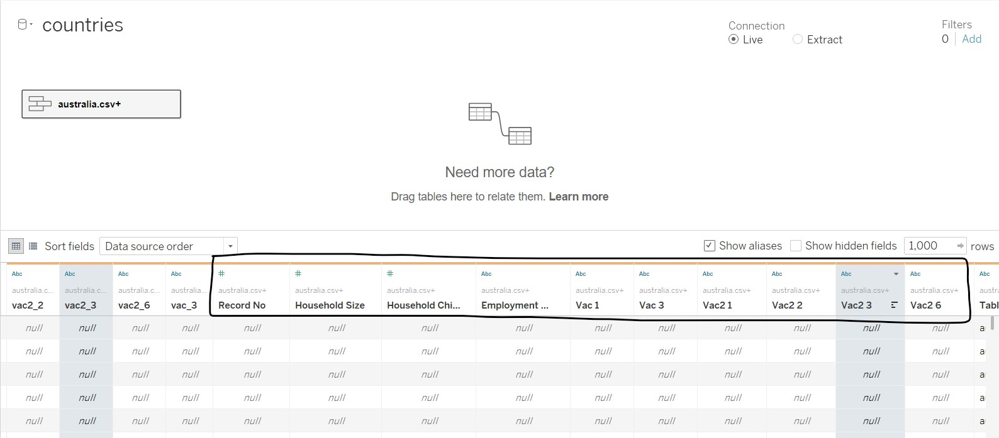

The "Merge Mismatch Field" is used to combine similar fields together. After merging, the fields were reviewed and renamed accordingly. For "Table Name", it was renamed to "Country", and aliases were used to rename the filenames to country names.

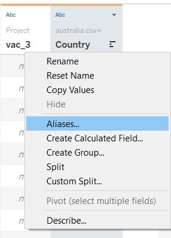{width=50%}

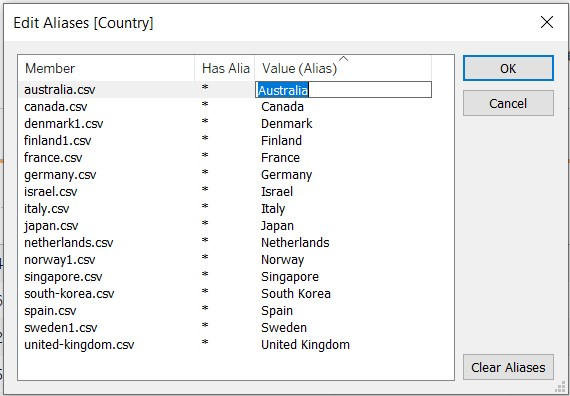{width=80%}

The data values under each field were checked through using the "Alias" option. It was noted that there were some issues with the Israel dataset after the union was made. However, as the issue cannot be resolved, Israel was removed from the analysis and visualisation.

For the vac fields, the extent of agreement and disagreement are explicitly spelt out.

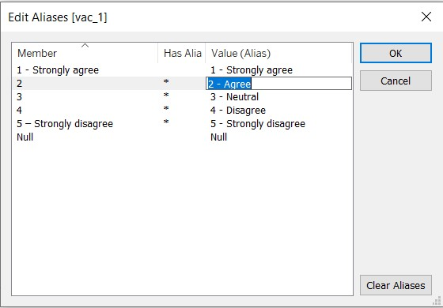

The figure below shows the final table after data preparation.

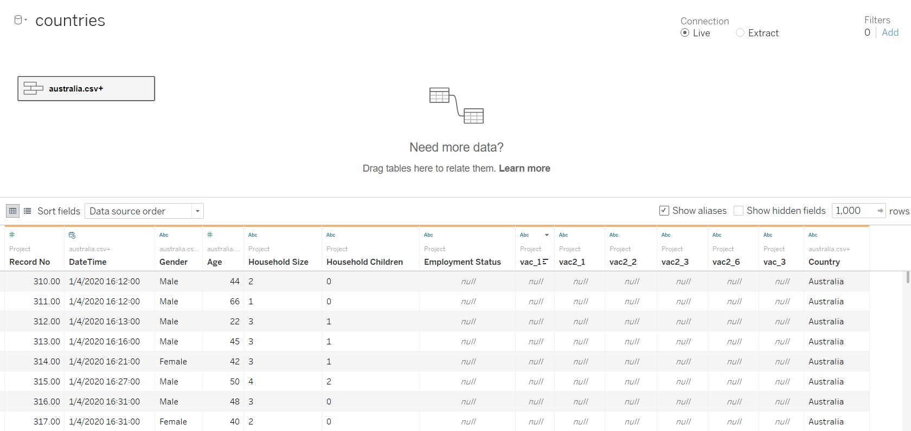

### 4. Create the diverging stacked bar chart

To create the graphs, move to Sheet 1 at the bottom of Tableau.

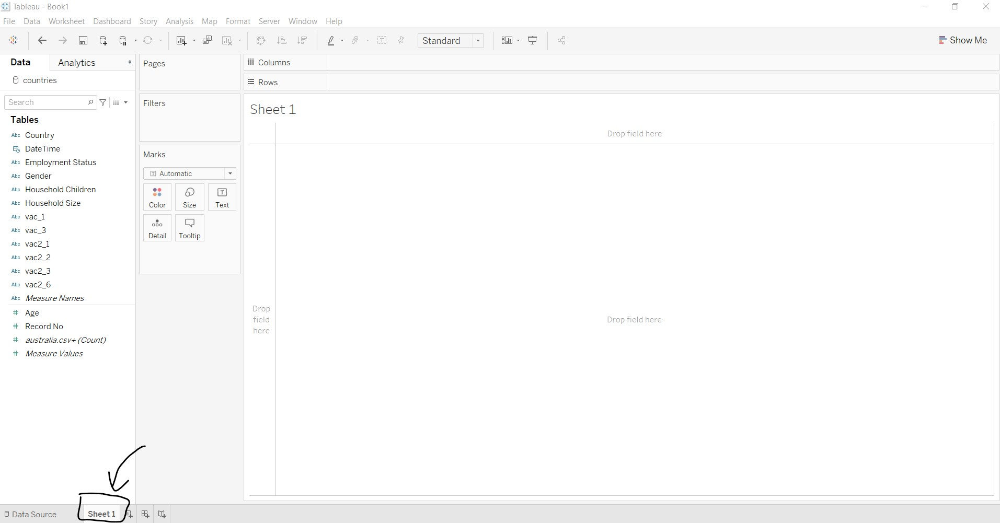

Several calculated fields need to be created, as shown in the table below.

Field name | Formula
-----------|-------------
Number of Records | 1
Total Count | TOTAL(SUM([Number of Records]))
Count Negative | IF [vac_1]="5 - Strongly disagree" THEN 1 ELSEIF [vac_1]="4" THEN 1 ELSEIF [vac_1]="3" THEN 0.5 ELSE 0 END
Total Count Negative | TOTAL(SUM([Count Negative]))
Percentage | SUM([Number of Records])/[Total Count]
Gantt Start | -[Total Count negative]/[Total Count]
Gantt Percent | PREVIOUS_VALUE([Gantt Start])+ZN(LOOKUP([Percentage],-1))

The following steps are taken to create the calculated fields:

1. Under Data tab, click on the black dropdown arrow near the search bar and select "Create Calculated Field..."

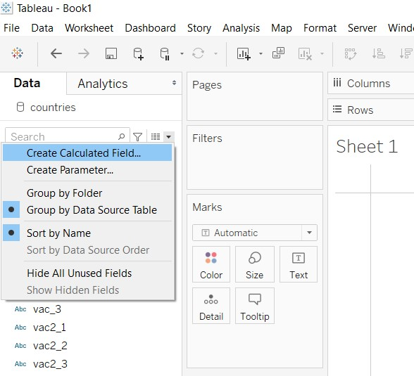

2. Enter the field name and formula as shown below.

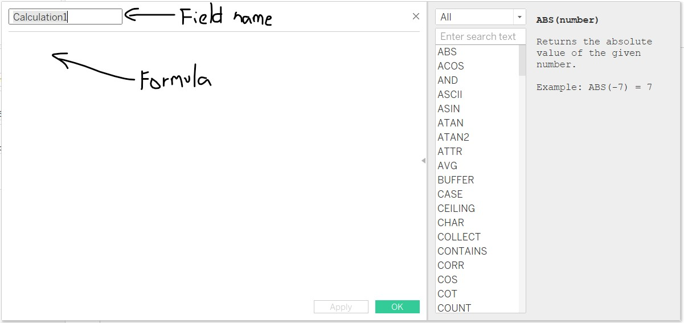

3. Repeat steps 1-2 for each calculated field

The next step would be to create the diverging stacked bar chart!

1. Add "Gantt Percent" and "Country" into Columns and Rows respectively

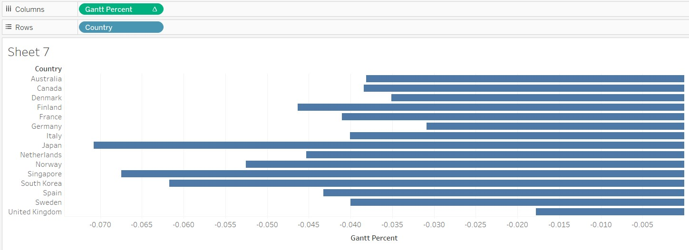

2. Add "vac_1" to Details in the Marks card

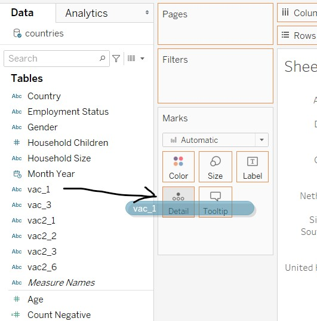

3. Under Columns, right-click "Gantt Percent", go to Compute Using and select "vac_1"

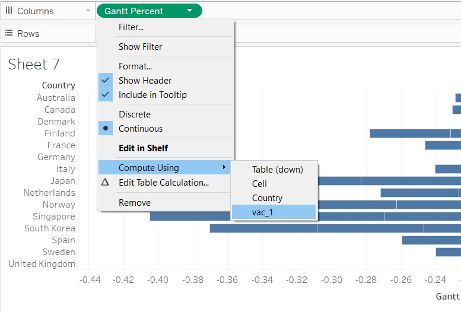

4. Under the Marks card, change the chart type to "Gantt Bar"

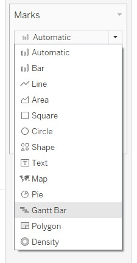

5. Click and drag "vac_1" into Colour in the Marks card

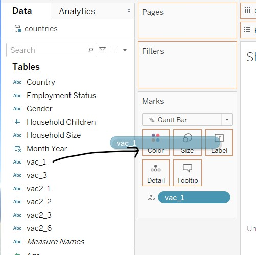

6. Click and drag "Percentage" into Size in the Marks card

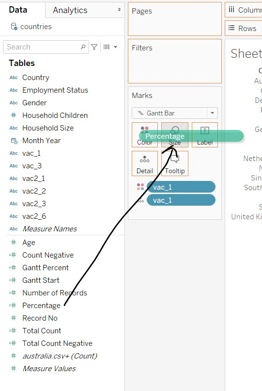

7. Click and drag "vac_1" into the Filters card

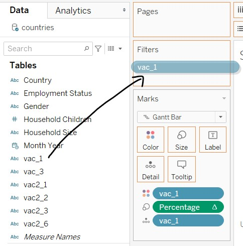

8. In the windowlet, deselect Null and close the windowlet

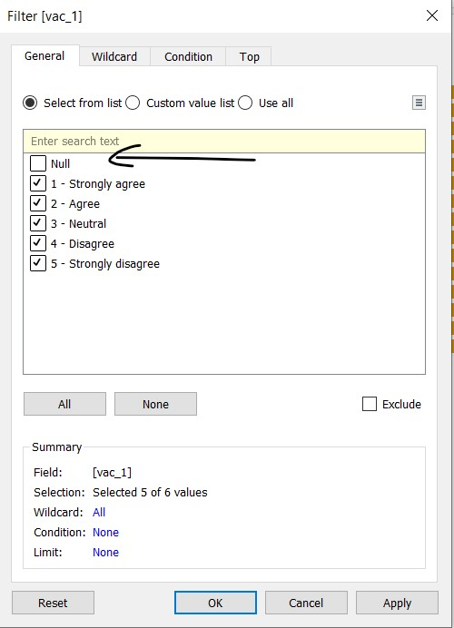

9. At the legend, click on the black dropdown arrow and select "Edit Colors..." to change the colour palette. The Traffic Light palette is chosen to show that agreement in a positive tone (green), disagreement in a negative tone (red), and neutrality in paler colour (yellow). The strength of the response i.e. "strongly" is reflected by the intensity of the colour.

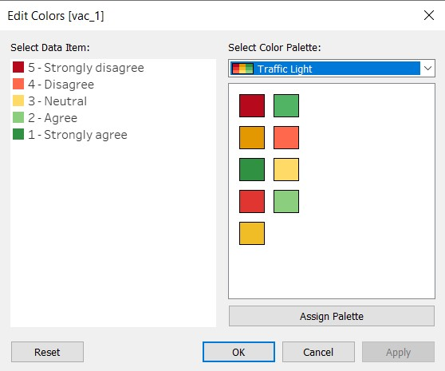

10. At the legend, click on the black dropdown arrow and select "Sort..."

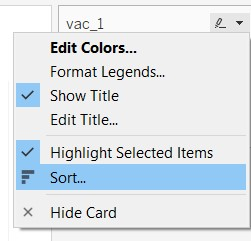

11. In the windowlet, select "Descending" to place the negative responses on the left and positive responses on the right

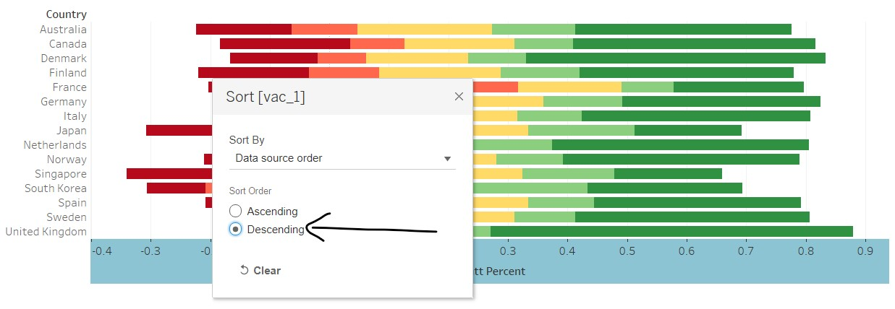

12. Right-click on the x-axis and deselect "Show Header" - x-axis removed as it would not be useful due to the negative figures. Any information on the values will be added in as a tooltip (covered in subsequent steps)

The base diverging stacked bar chart is now complete! The next step will be to add in the interactive features using the filters. The following are added as filters:

* Gender
* Age
* Employment Status
* Household Size
* Household Children
* Month

In the earlier sketch, country was added as a filter as the initial thought was that there were many countries not reflected. However, due to data limitations, only 14 countries are shown, which is similar to the original visualisation.

The following steps are taken to add the filters:

1. Right-click "Age" and select "Convert to Dimension"

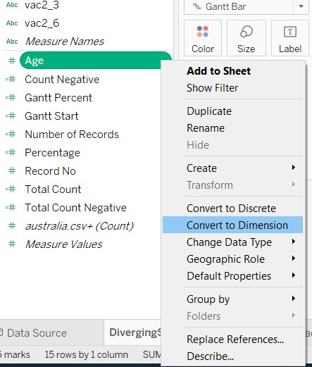

2. Click and drag the above mentioned dimensions to the Filters card
    * For Age, a windowlet will appear. Click all and select "Ok"
    * Right-click "Age" and select "Continuous"
    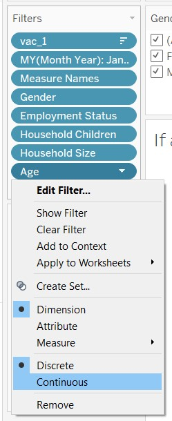

    * A windowlet will appear. Click "OK"
    
    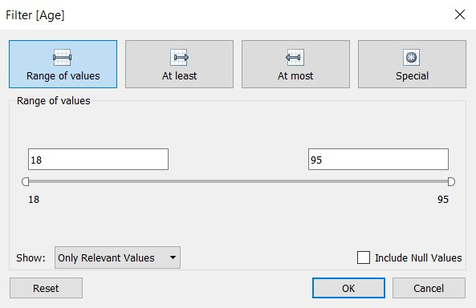

2. For each filter, right-click and select "Show Filter"

3. Re-arrange the filter cards by dragging it around the workspace

4. The filter cards were renamed for simplicity and changes were made to the filter controls by right-clicking the black dropdown arrow for each filter card

Filter | Control
-------|--------
Gender | Multiple values (list)
Age | Range of values
Employment Status | Multiple values (dropdown)
Household Size | Multiple values (dropdown)
Household Children | Multiple values (dropdown)
Month | Single value (list)

The last step would be to beautify the graph! A chart title is added and the legend was also shifted to the bottom of the graph and renamed to "Response". The figure below shows the final graph.

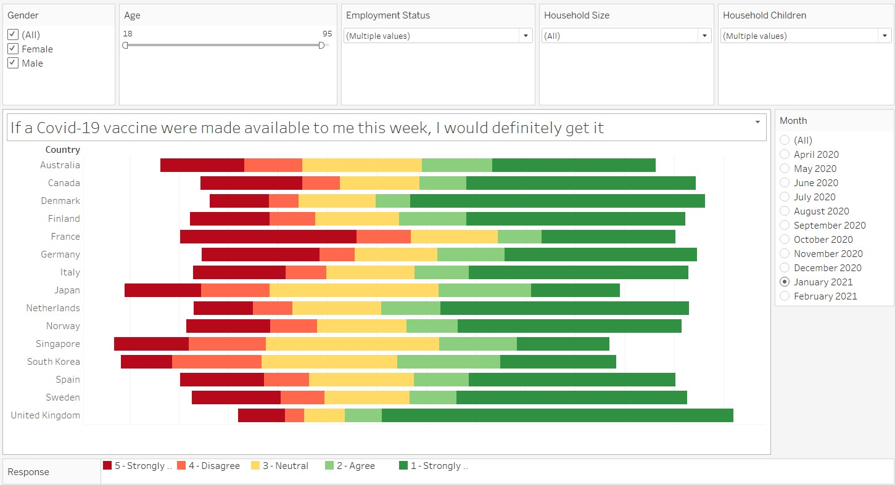

### 5. Create the graphs for the tooltip

The following steps are taken to create the graph for the tooltips:

1. In a new sheet, click and drag "vac2_1" into Rows and "Number of Records" into Columns

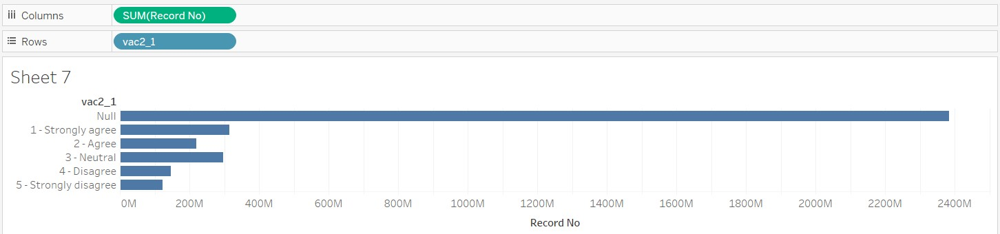

2. Click on "Show Me" and select the "stacked bars"

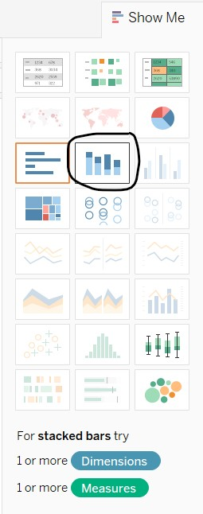

3. Click on the icon shown below to orientate the stacked bar chart horizontally

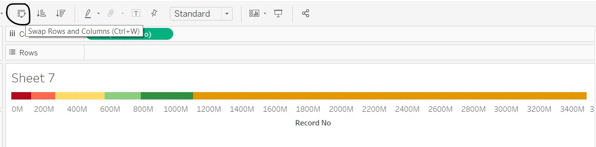

4. Click and drag "vac2_1" into the filters and deselect Null values

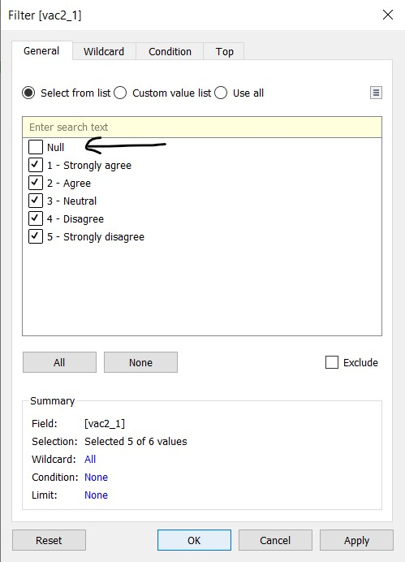

5. Right-click on the x-axis to edit the axis. Remove the title

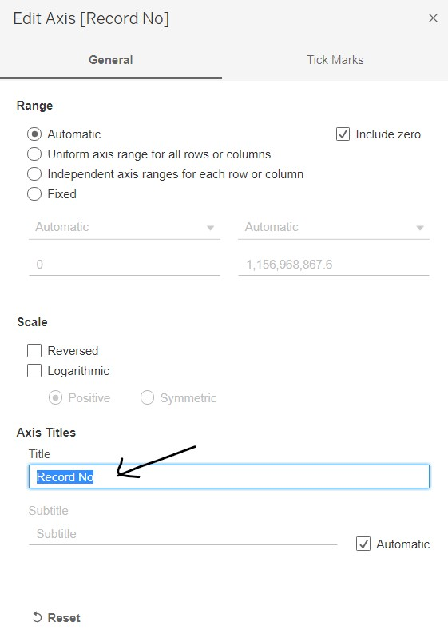

6. Go to the "Tick Marks" tab and select "None" under Major Tick Marks. Close the windowlet

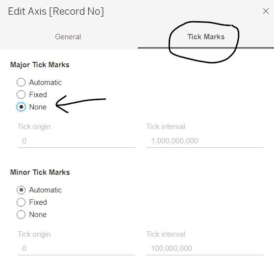

7. At the legend on the right, click on the dropdown arrow to edit colours, similar to the diverging stacked bar chart.


8. Add in the survey question as the title of the sheet and resize the graph to be able to fit in the tooltip. Right-click the x-axis and unselect "Show Header"

The above steps are repeated for vac2_2, vac2_3, vac2_6 and vac_3. As a shortcut, the sheet for vac2_1 was duplicated, and the sheet title and variables were updated accordingly.

Back at the diverging stacked bar chart sheet, select "Tooltip" under the Marks card. In the windowlet, enter in the survey response and click on Insert/Sheets and select the corresponding graphs. Resize the font accordingly to fit into the tooltip box.

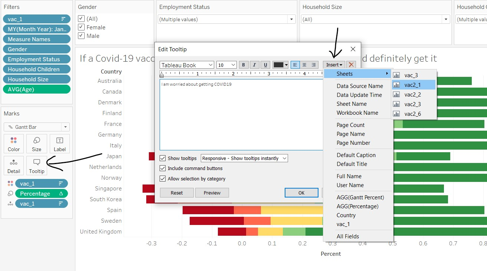

Other useful information are also added into the tooltip, as shown below.

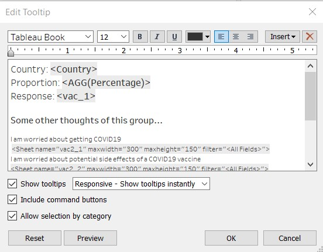

The end product looks like this!

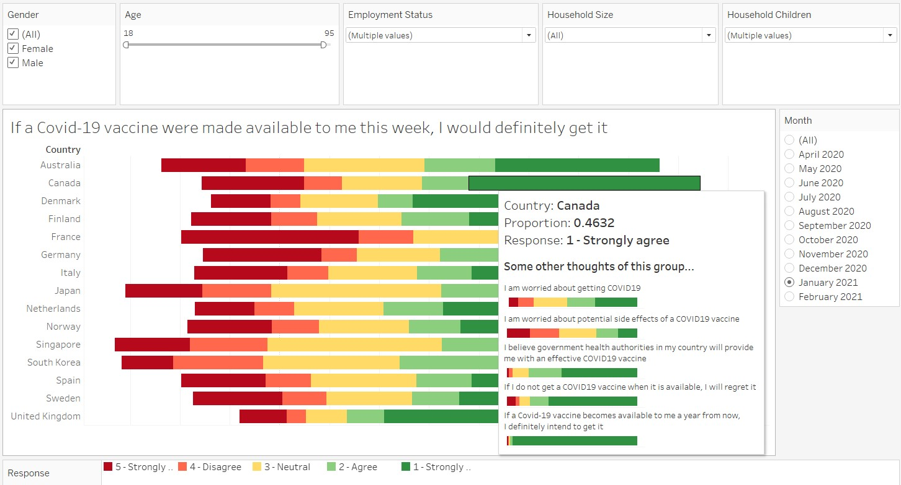

### 6. Create the error bar on bar chart

In order to allow interactivity with the response and confidence level, two parameters need to be created: Response and Confidence Level.

The following steps are taken to create the parameters:

1. At the Data tab on the left panel, click on the black dropdown arrow and select "Create Parameter..."

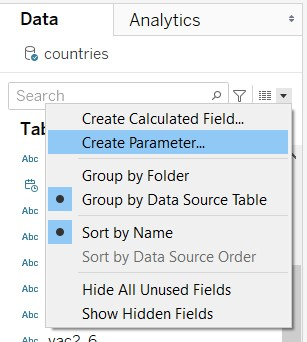

2. For "Response", enter the values shown in the figure below (note that the values can be added from dimensions):

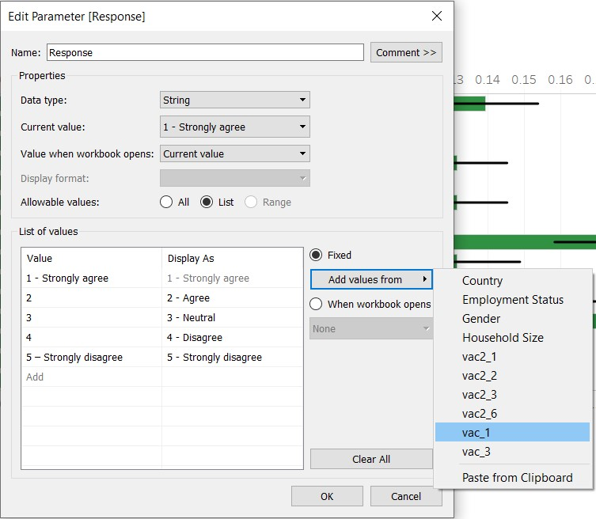

3. For "Confidence Level", enter the values shown in the figure below:

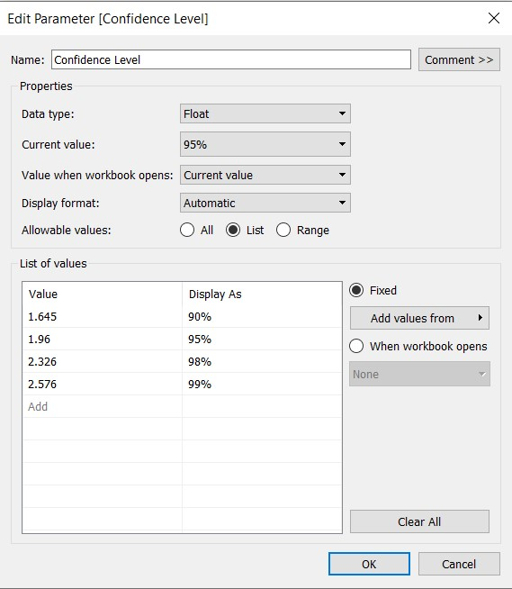

The following calculated fields need to be created for the error bar:

Field name | Formula
-----------|-------------
Count_Response | IF [vac_1]=[Response] THEN 1 ELSE 0 END
Prop_Response | SUM([Count_Response])/SUM([Number of Records])
Prop_Response_Margin of Error | [Confidence Level]*(SQRT(([Prop_Response]*(1-[Prop_Response]))/SUM([Number of Records])))
Prop_Response_Lower | [Prop_Response] - [Prop_Response_Margin of Error]
Prop_Response_Upper | [Prop_Response] + [Prop_Response_Margin of Error]

Refer to earlier steps on how to create calculated fields.

Next, the error bar on bar chart is created taking the following steps:

1. Click and drag "Prop_Response" to Columns and "Country" to Rows
2. Drag Measure Values to the dual-axis line for the x-axis

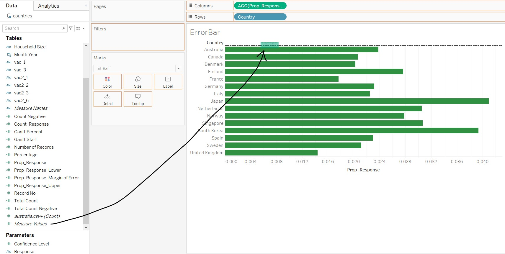

3. Remove all fields except for "Prop_Response_Lower" and "Prop_Response_Upper"

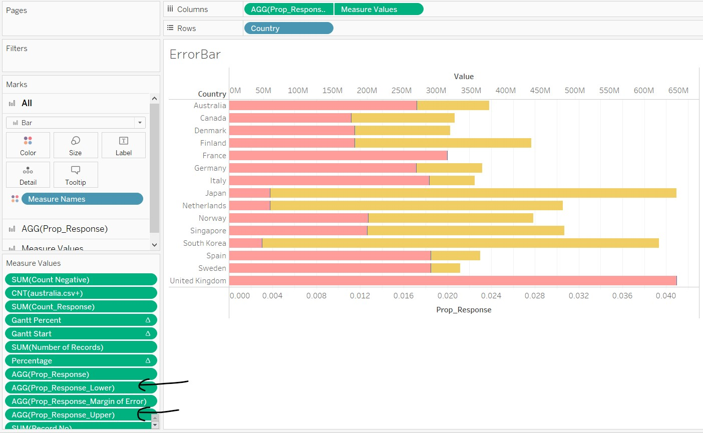

4. Right-click the x-axis and select "Synchronize Axis"

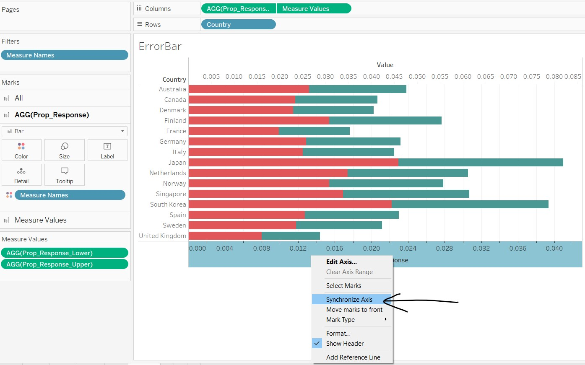

5. In the Measure Values card, change the chart type to "Line"

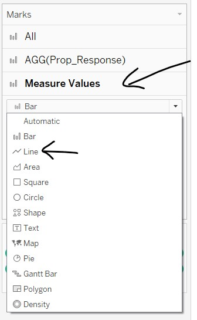

6. Click and drag "Measure Names" to "Path

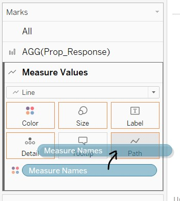

7. Click and drag "vac_1" to Filters, and select all except Null

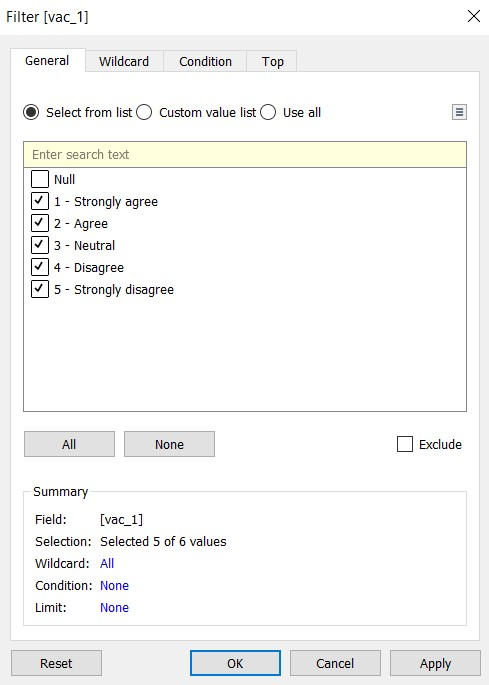

8. To show the parameters, right-click on the parameter names and select "Show Parameter". Change the parameter options to "Single Value List"

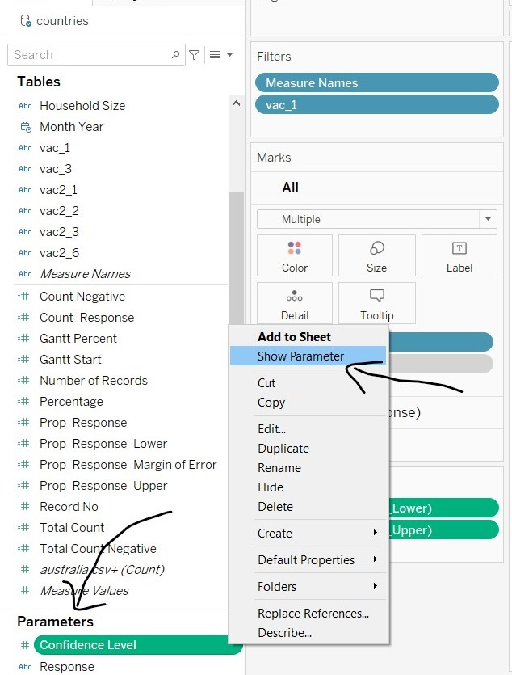

9. To align the colour of the bar chart to the same colour palette used in the diverging stacked bar chart, click and drag "Response" to Colour in the AGG(Prop_Response) card.

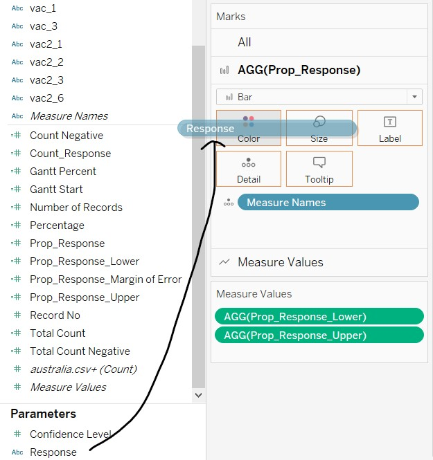

10. To change the colours, toggle between the response values in the Parameter card and the legend. Use the same traffic light colour palette 

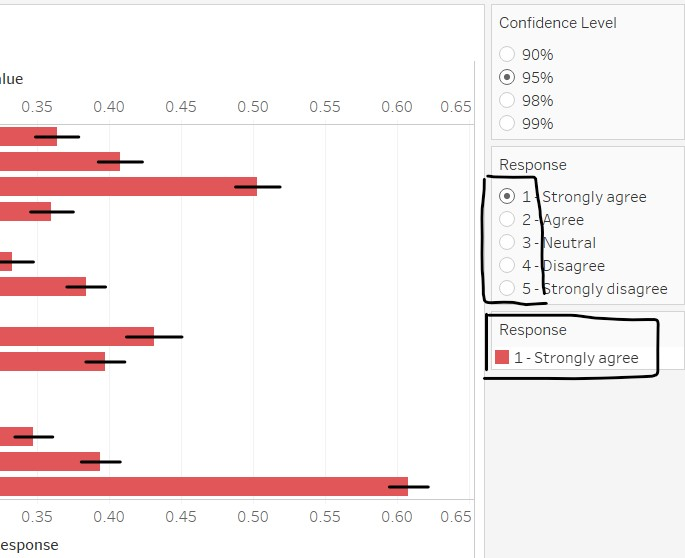
11. Sort the graph in descending order 

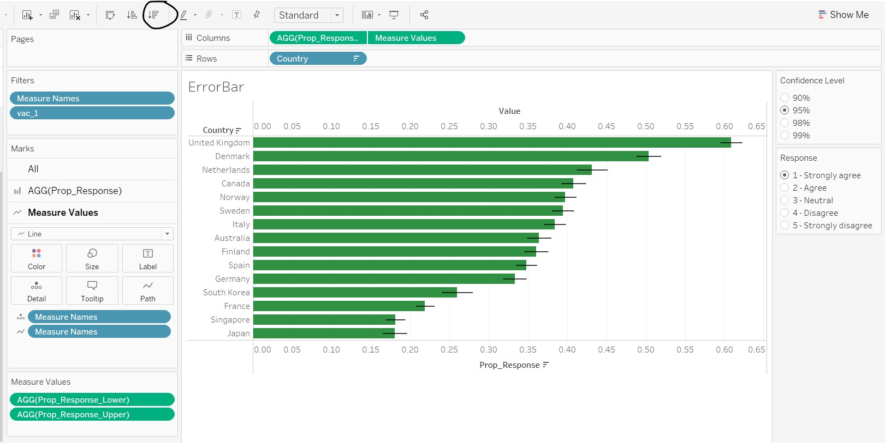

12. Other amendments were made to beautify the graph, such as giving a title, amending the tooltip, removal of the dual x-axis header and colour legend, and aesthetic changes on the line thickness.

The final error bar on bar chart is shown below.

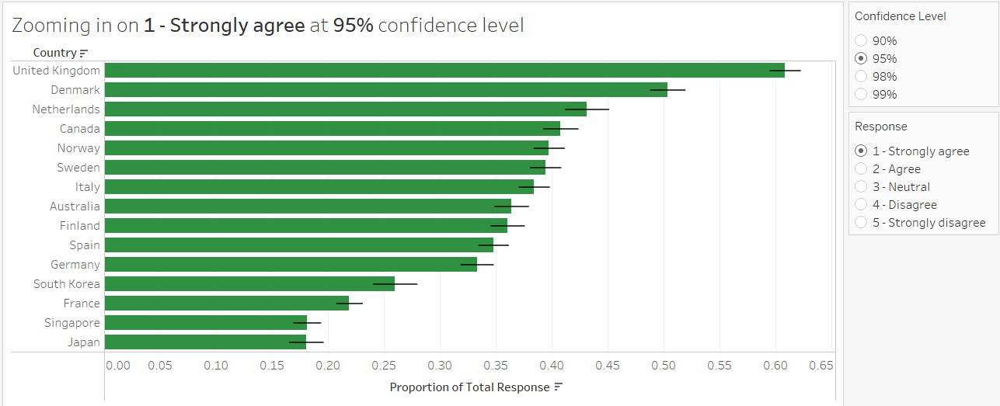

### 7. 
### 8. 

# (e) Major observations revealed by the final product

