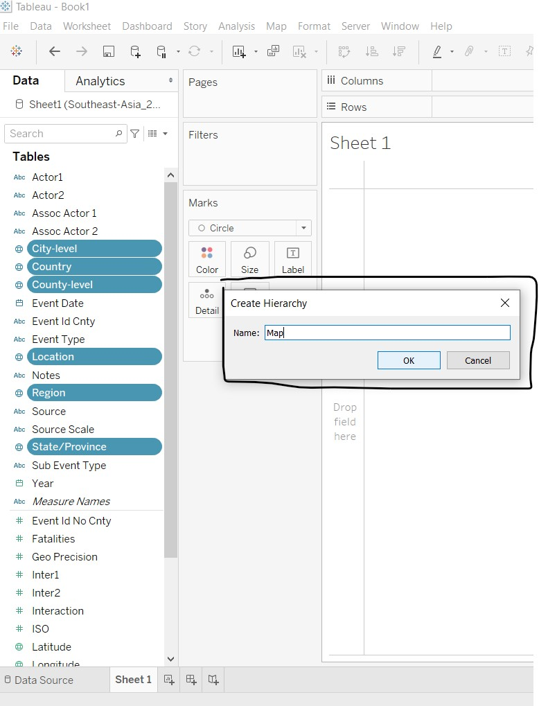
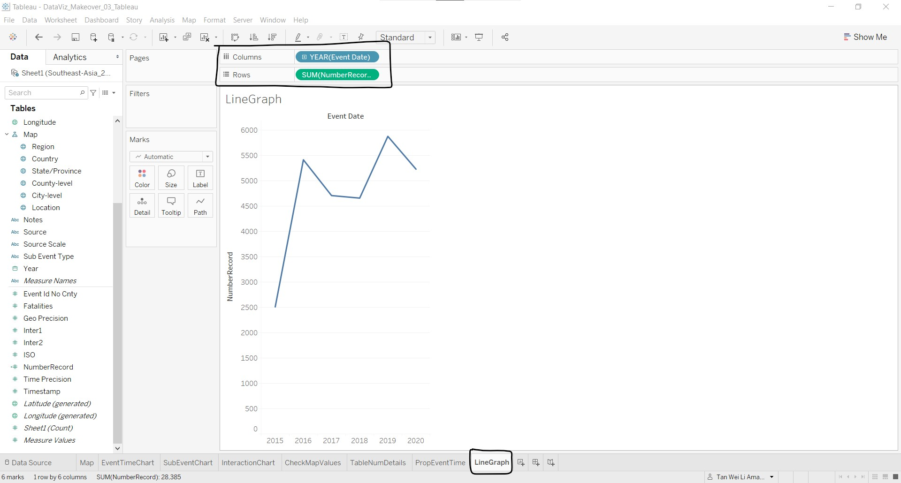

```{r setup, include=FALSE}
knitr::opts_chunk$set(echo = FALSE)
```

# The Data Visualisation

The South-east Asia Armed Conflict Analysis is a data visualisation created to reveal spatio-temporal patterns of armed conflict in selected South-east Asia countries between 2015-2020. The link to the interactive visualisation can be found [here](https://public.tableau.com/views/South-eastAsiaArmedConflictAnalysis/South-eastAsiaArmedConflictAnalysis?:language=en&:display_count=y&:origin=viz_share_link).

{width=120%}

# (a) Critique of current visualisation

There are three evaluation criteria in this critique: (i) clarity; (ii) aesthetics; and (iii) interactivity. Each criterion will be discussed individually, and discussion points that cut across criterion will be placed with the main criterion that it falls under, with highlights on how the other criteria are affected.

## Clarity

### 1) Good choice of chart types

The choice of map to show the location of armed conflict events, encoded by colour and shape to differentiate the different types of armed conflict events, is good as the audience can perceive location together with distance on a map better and other patterns of the data can also surface with the use of the colour and shape scales.

The line graphs are also appropriate to show the trend of armed conflict events over time.

### 2) Unable to see data points clearly when clustered together on the map

In areas with high number and variety of armed conflict events, the data points on the map overlap. As the data points are opaque with no borders, this results in two issues, discussed below.

#### A) Difficulty in identifying the number of data points of the same colour

The main purpose of the map is to show the location of armed conflict events. In locations with high number of events, the map would provide the intensity of events, depicted by the number of data points in the area. As seen from the diagram below, it is difficult to differentiate the data points of the same colour as they form one big mass due to the lack of borders or outlines. This reduces the clarity on the number of armed conflict events happening within the area.

{width=50%}

#### B) Unable to tell if there are any data points (and its colour) covered by the data point at top layer

At the country level (zoomed-out view), the overlapping of the opaque data points causes those data points at the bottom layers to be obscured by the data points at the top layer, as shown in the diagram below. As such, the audience has no clarity on the other types of armed conflict events that occur within the area.

{width=50%}

Another problem that the opaque data point causes is that the audience is unable to tell the name of the area when the data points occur where the names of the area are placed. In the diagram below, the word "Myanmar" could hardly be seen although we could argue that the general public could still make out the word "Myanmar" due to familiarity. However, if we go down to the division/state/region level, one who is not familiar with the Myanmar system would not be able to make out the names of the divisions/states/regions that are fully/partially obscured by the data points, e.g. "Chin" and "Naypyitaw" in the diagram below.

{width=80%}

### 3) Information in map data point tooltip not useful

In the interactive version of the visualisation, a tooltip (see diagram below) is shown when mousing over each data point on the map. The *Event Id Cnty* shows the individual event identifier by number and country acronym; the *Event Type* shows the type of armed conflict event; and the *Latitude* and *Longitude* show the latitude and longitude of the location respectively. The *Event Id Cnty*, *Latitude* and *Longitude* are very specific and too detailed, which does not value-add in the understanding of spatio-temporal patterns of armed conflict in the area.


### 4) Issues with y-axis range in line graphs

The line graphs are small multiples, showing manageable chunks of information in a single view. This makes it clean and easy to view and compare the data patterns. However, the range of each y-axis differs across the different line graphs, and the y-axis does not start at zero. This causes the audience to focus on the patterns and overlook the actual numbers, and misleads the audience into thinking that the patterns give a good representation of the values. To illustrate the point, let us take a closer look at the line graphs for Protests and Strategic developments. 


The number of Protests in 2020 decreased drastically from 2019, whereas the number of Strategic developments has seen a steady increase from past years. The graph patterns seem to indicate that Strategic development has a much higher number of events than Protests, and that the number of Protests is close to zero, but it is not so when we compare the values! In 2020, the number of Protests is about 125-130, and the number of Strategic development events is about 150.

### 5) Order of event types in line graphs not intuitive

At first glance, the order in which the line graphs are arranged vertically is not clear, a result of different ranges in the line graphs as discussed earlier. Upon a closer look, the sort icon in the x-axis indicates that the line graphs are sorted in descending order. However, this is still not apparent from the line graphs themselves, and require the audience to trace the number of events across line graphs in order to understand the sorting.

{width=80%}

### 6) Different data aggregation does not support spatio-temporal analysis

The map view shows the **spatio patterns** of armed conflicts as a **total of the six years**, whereas the line graphs show the **temporal patterns** of the **annual number** of armed conflicts **over the six years**. As the data aggregation is different, the audience is unable to draw the relationship between the spatio pattern and temporal pattern of the data from the visualisation, i.e. cannot tell what is the trend of armed conflict events over time of a specific region of the country.

{width=120%}

## Aesthetics

### 1) Issues with shape encoding on map

There is shape encoding in the map visualisation, however, the size of the data points is too small for the audience to make out the shape unless one scrutinises the data points or has a sharp eye for details. The size of the data points remain unchanged even after zooming in.


From the diagram above, we can see that there is no legend to inform on the shape encoding. It is not clear what is being encoded by the shape. In addition, there is no differentiation in the data point tooltip information for the audience to make a guess at what the shape encodes. This reduces the clarity of the shape aesthetic.

{width=40%}

{width=40%}

### 2) Good amount of non-data ink for the line graphs

There is a good amount of non-data ink for the line graphs, making the design clean and easy to read.

As the graph titles are usually placed at the top or bottom of graphs, the label *Event Type* at the top of the graphs direct the audience to where the title actually is. Putting the graph titles at the side also allows for easier vertical comparison of the data without any visual interruption, but we could also argue that the eye needs to go left and right in order to identify which line graph is for which event type.

{width=80%}

On the other hand, the label *Event Date* may be misleading as only the year component of the event dates are shown in the x-axis. As the x-axis labels are only at the bottom, it is a relatively long distance to trace between the first graph at the top to the x-axis labels to identify the corresponding year for each data point in the line graphs. It would be better if *Event Date* is replaced with year labels repeated  at top. There is no need for the *Year* x-axis title as it will be intuitive that year is being represented on the x-axis with the labels themselves.

{width=80%}

The y-axis titles for the line graphs do not provide value to the audience as it refers to a *Sheet1* that the audience have no idea about and no access to. Furthermore, the y-axis title is orientated vertically and is repeated for each line graph, which makes it hard to read and does not value-add in understanding what the line graphs are plotted against.

{width=80%}

### 3) Colour scale not employed across graphs

The map uses colour to encode the event type (mapping shown in the legend on the right), however the line graph uses the same colour blue as *Battles* in the map, for all the event types. Furthermore, colour perception is more powerful and efficient than reading and understanding textual description, i.e. graph titles. This means that the audience would need to work harder in linking and de-linking colours, and  reading the graph titles, when switching between the map and line graphs.

### 4) Position of colour legend too far from map

As the colour scales are only used in the map, the audience need to trace horizontally across the entire visualisation to refer to the colour legend. The legend should be placed appropriately near to where the colour scale is used for the audience to have easy reference.

## Interactivity

### 1) Different views allowing multi-dimensional analysis

The visualisation shows two different views of the data on screen: map and line graphs. This allows for interaction with the two graphs and easy comparison of data between the two views (though limited, as discussed earlier under point 6 of the clarity criterion). 

### 2) Limited interactive capabilities

Both views provide navigation to view low-level detail (i.e. tooltip information) and selection functions (pointer and drag-box) to highlight data points of interest. There is a filter function to allow analysis of the data by country of interest and users are also able to highlight data by event types. The map view provides basic map interaction such as zoom, pan and added selection functions of radial and lasso selections. The line graphs view has the sorting function, which was discussed earlier under point 5 of the clarity criterion. 

{width=120%}

The features and usability of the interactivity will be discussed in more detail next.

#### A) Added tooltip with drag-box selection not useful for map view

{width=80%}

With the selection of a set of data points, the user is able to mouse over to view the tooltip information of the selected points. The plus point is that there is an option to access the data of the selected data points, and the minus point is that the *SUM of AVG(Longitude)* value does not make any sense for the selected data points.

#### B) Useful information/feature in added tooltip with drag-box selection of a **single year** in line graphs

{width=80%}

Similar to the drag-box selection in the map view, the user is able to view the tooltip information of the selected data points. *SUM of CNT(Sheet1)* field provides the total number of events for the selected data points, which is useful information. The sorting feature is also useful, since it is visually difficult to compare the values and sorting the data would help to see the order. The diagram below shows the output after sorting 2016 data in descending order. 

{width=80%}

The sorted display of the line graphs does not have any indication that the data is sorted should the user remove the selection. To make matters worse, the difference in the y-axis range across the line graphs and the y-axis not starting at zero do not aid the user in perceiving the sorting order (ascending or descending).

#### C) Sorting feature in added tooltip not useful with drag-box selection **across years** in line graphs

If the user wants to find out more on the number of *Explosions/Remote violence* and *Violence against civilians* events between 2016 and 2018, the visualisation allows the selection and displays the sum of the events when mousing over one of the data points.

{width=80%}

The sorting feature is also available, and the output after sorting is shown below.

{width=70%}

This sorting feature and its output create confusion to the user due to the following:

* Chart type changes to a bar chart: data shown is the same, but user is required to switch from perceiving lines graphs to bar graphs
* Year order for the selected years changes: order does not make sense, even when user tries to decipher from the bar graphs. The change is also subtle and might go undetected

In addition, the selection function changes to a radial selection after sorting was done, and there is no option for user to switch to other selection options on the line graphs.

{width=70%}

#### D) Filter feature is flexible

The visualisation allows user to filter the data displayed by all countries or a specific country. The map view corresponds to the filter selection, i.e. the map pans to the country that is being selected. For example, the map view pans to show the entire region when *(All)* is selected. The data in the line graphs also changes, as can be seen by the change in the y-axis range.

{width=120%}

The filter function also allows for filtering by multiple countries, although this requires some exploration on the part of the user. Notice that the map view now pans to show the area that covers the selected countries only.

{width=120%}

The multiple selection of countries is achieved by clicking on the dropdown arrow on the *Country* filter and selecting *Multiple Values (list)*, as shown below. The user can also choose to perform filter by inclusion or exclusion.

{width=40%}

It was observed that the line graphs are designed to show total values by event types based on the country filter. This means that the line graphs do not support comparison of event types across countries, should the user want to compare between countries.

#### E) Highlighting draws attention to selected records

The highlighting feature is useful to view the data points for selected event types, especially in the map view. As seen from the diagram below, selecting *Strategic development* on the *Event Type* colour legend highlights the corresponding data points on the map and the line graph, and the other data are "greyed out". 

{width=120%}

However, as the data points on the map are opaque and overlap with each other, it is difficult to make comparison between event types on the map view (as mentioned earlier under point 2 of the clarity criterion). The following diagram showing the selection of *Battles* and *Strategic development* further reinforces this difficulty.

{width=120%}

Another point to note is that the order of the line graphs and the order of the event type legend are not aligned for *Violence against civilians*, *Protests* and *Riots* event types. This is counter-intuitive to the user in perceiving the sequence of the line graph with reference to the legend, and vice versa.

{width=80%}

### 3) No coordinated highlighting between the two views

Although the visualisation places the map and line graphs side-by-side, the two views are not coordinated. Selecting data points in one view does not highlight the corresponding data points in the other view. The diagram below shows the selection of all the 2016 data points in the line graphs, but the 2016 data points are not highlighted in the map view. 


# (b) Alternative Data Visualisation and Interactive Techniques

In general, the map and line graphs design is retained to show the spatio and temporal patterns of the data. The table lists the changes made to improve the current design and its advantages.


| Issues | Proposed Changes | Advantages|
|--------|------------------|-----------|
||||
| Clarity: Unable to see data points clearly when clustered together on the map <br> Aesthetics: Issues with shape encoding on map | - Proportional symbol map with some degree of transparency <br> - No shape encoding <br><br><br> | - Differentiate data points clearly without obscuring<br> - Able to estimate number of data points based on size <br><br>|
| Clarity: Information in map data point tooltip not useful <br><br><br>| Tooltip to show detailed information such as location (instead of codes, latitude and longitude), trends over time, and breakdown by sub-event type and interaction | - More useful information provided <br> - Allow analysis of data over time <br><br><br>|
| Clarity: Issues with y-axis range in line graphs<br> Clarity: Order of event types in line graphs not intuitive<br> Clarity: Different data aggregation does not support spatio-temporal analysis <br><br>| - Horizontal comparison of line graphs for event types <br> - Countries are plotted within the same event type <br> - Use of log scale in y-axis of line graphs <br><br><br><br> | - Remove the need for ordered plots <br> - Allow comparison across countries and time <br> - Position of legends will be beside relevant graphs <br> - Any differences across event types, countries and time can be seen and compared easily |
| Aesthetics: Colour scale not employed across graphs | - Align use of colour encoding in proportional symbol map and line graphs | - Allow quicker and more intuitive comparison across graphs |
| Interactivity: No coordinated highlighting between the two views <br> Possible interactivity not upfront and requires exploration by user <br><br> | - Line graphs placed below proportional symbol map <br> - Interactive options for each graph to be more upfront <br><br>| - Clear demarcation of the two graphs as separate graphs <br> - Able to know what are the possible interactivity available/useful for the visualisation |

A sketch of the proposed design is shown below.
{width=80%}

# (c) Final product of proposed visualisation

The proposed visualisation is designed using Tableau and uploaded on Tableau Public. The link can be found [here]().

# (d) Step-by-step description to prepare the final product

### 1. Import file into Tableau

Upon opening Tableau, click on **More...**, go to the directory containing the data file, select the file and click **Open**.

{width=80%}

### 2. Check variables data type

At the **Data Source** tab, check through the data types of each variable and change the data type where necessary. The table below lists the affected variables.

|Variable|Data Type|
|--------|---------|
|Year| Number to Date|
|Region| String to Geographic Role - Country/Region|
|Admin1| String to Geographic Role - State/Province|
|Admin2| String to Geographic Role - County|
|Admin3| String to Geographic Role - City|
|Location| String to Geographic Role - City|

The following steps were taken to change the data type of **Year**:

1. Go to the icon at the top left corner of the header cell containing the variable **Year**


2. Click and select the desired data type, i.e. **Date** for **Year** variable


The above steps are repeated for the remaining variables.

### 3. Rename variables

The following variables are renamed for easy understanding:

|Current Variable Name| New Variable Name|
|--------|---------|
|Admin1| State/Province|
|Admin2| County-level|
|Admin3| City-level|

The rename is done by selecting **Rename** under the dropdown arrow at the top right corner of the header cell containing the variable, as shown below.


### 4. Filter to only select data between 2015 ad 2020

Keeping to the same range of data as the original visualisation, the filter need to be done at the **Data Source** tab so that the user will not be able to change the year range beyond 2015 to 2020 when interacting with the visualisation. The steps taken are:

1. At the top right corner of the **Data Source** tab, click on **Add**


2. At the *Edit Data Source Filters* pop-up window, click on **Add...**


3. At the *Add Filter* pop-up window, select **Event Date** and click **OK**


4. At the *Filter Field [Filter Field [Event Date]]* pop-up window, select **Years** and click **Next >**


5. At the *Filter [Year of Event Date]* pop-up window, check the boxes for **2015**, **2016**, **2017**, **2018**, **2019** and **2020**, and click **OK**


6. At the *Edit Data Source Filters* window, check the filter added and click **OK**


7. Back at the **Data Source** tab, notice that a filter has been added at the top right corner of the screen


### 5. Create hierarchy for geographic variables

Hierarchy is added for variables with geographic roles. This is done for easy reference to the variables. The steps taken are as follows:

1. Select all variables with geographic roles, right-click and select **Hierarchy/Create Hierarchy...**


2. At the pop-up window, enter the name of the hierarhcy, i.e. **Map**, and click **OK**



3. Click-and-drag the variables to reorder them in the following order: Region -> Country -> State/Province -> County-level -> City-level -> Location


### 6. Create the base proportional symbol map

1. Click and drag **Country** to the plot area as shown below


2. Click on the **+** button beside **Country** to expand the hierarchy till the end. Note that the map changes with each expansion to show the data for each hierarchy level.


After expanding, it was noted that there are more than 6K data points with unknown geogrpahic locations.


After investigation, it was found that Tableau does not recognise some **City** and **State/Province** values for some countries, based on the latitude and longitude values generated by Tableau. As such, the map needs to be based on the latitude and longitude values provided in the dataset.

3. Clear the plot area by right-clicking and selecting **Remove** for each variable used for the plot


4. Convert **Latitude** and **Longitude** from *Measures* to *Dimensions*


5. Click-and-drag **Latitude** to *Rows* and **Longitude** to *Columns*


Notice that there are more data points shown on the map and no more indicator of unknown geographic values! We can continue our journey to create the proportional symbol map now.

6. Click and drag **Sheet1(Count)** to **Size**


4. Click **Color** and select **Opacity** to be **70%** and change the **Border** to medium-grey


5. Click **Size** and resize the circles to be larger, so that users can easily see them


6. Click and drag **Event Type** to **Color**


And the base proportional symbol map is done!



### 6. Adding filters to the proportional symbol map

1. Click and drag **Country** to **Filters**


2. At the *Filter [Country]* pop-up window, click **OK**


3. Click and drag **Event Date** to **Filters**


4. At the *Filter Field [Event Date]* pop-up window, check that **Range of Dates** is selected and click **Next >**


5. At the *Filter [Event Date]* pop-up window, click **OK**


6. At the *Filters* card, click the **Country** dropdown arrow and select **Show Card**. Repeat this step for the other filter **Event Date**.


After some cosmetic changes such as editing the filter titles, re-ordering the filter cards and removing the legend card for the count, the screenshot below shows the proportional symbol map.


### 7. Adding another marks layer to the map

From the proportional symbol map above, it is not clear where the country borders are and the position of some data points near the borders. As such, we will add in another marks layer to demarcate the map area for each South-east Asian country.

1. Right-click **Country** and select **Add to New Layer**


2. Click-and-drag **Country** layer to after **Latitude** layer, so that the data points layer will be above the land area layer


3. Click the dropdown list and select **Map**


4. Click-and-drag **Country** details to **Color**


5. Click on **Color** then **Edit Color**, change all countries to *Light Pink #DAB6AF* under the *Winter* color palette, and click **OK**


6. Click on **Color** to adjust the opacity to **2%** and change the border color to white


7. Remove the **Country** legend by hiding the card

### 8. Customise the proportional symbol map tooltip

There are two tooltips to create, one for the **Latitude** mark layer and the other for the **Country** mark layer. The table below shows the information to be added to each tooltip.

|**Latitude** mark layer | **Country** mark layer|
|------------------------|-----------------------|
|||
| State/Province and location<br> Event type over time<br> Sub event type breakdown<br> Interaction breakdown<br> Number of fatalities<br> | Country<br> Total number of events and fatalities by event type<br> Proportion of event type over time<br><br><br><br> |

#### Tooltip for **Latitude** mark layer

1. Convert **Interaction** to dimension by right-clicking and selecting *Convert to Dimension*


2. Edit **Interaction** aliases to display text instead of numbers by selecting *Aliases...* and entering the corresponding text provided in the ACLED codebook


3. Add **Country**, **State/Province**, **Location**, **Event Type**, **Sub Event Type**, **Interaction** and **Fatalities** to *Detail*


4. Next we create the required charts for the tooltip by clicking on the *New Worksheet* button near the bottom of the screen


5. Rename the new worksheet to *SubEventChart*, and drag **Sheet1(Count)** to *Columns* and **Sub Event Type** to *Rows*


6. Click on the button shown to sort in descending order


7. Next, we resize the chart and do some formatting of the axis font size


8. To be consistent with the use of colors for event types, add **Event Type** to *Color*, and the first chart is completed!


9. Similar steps are performed for the second chart, renamed as *InteractionChart*. In this chart, **Sheet1(Count)** is dragged to *Columns* and **Interaction** to *Rows* with **Event Type** under *Color*. The same formatting and resizing is done to the chart. Note that the bar charts is stacked by the different colours in this view.


10. To create the third chart, renamed as *EventTimeChart*, drag **Year** to *Columns*, and **Event Type** and **Sheet1(Count)** to *Rows*. Under *Show Me* at the right of the screen, select the *lines (continuous)* graph


11. Edit the axis titles as needed as right-clicking on the axis and selecting *Edit Axis*


12. At the *Tick Marks* tab for the y-axis, remove the minor tick marks by selecting *None*


13. Resize and format as necessary and the third chart is completed!
 


14. At the main worksheet under the **Location** *Marks* layer, check that **Interaction**, **Sub Event Type** and **(SUM)Fatalities** are under the *Detail*, and **Country**, **State/Province**, **Location** and **Event Type** are under the *Tooltip* in the *Marks* card


15. Click on *Tooltip* in the *Marks* card. Click on *Insert* and select the charts from *Sheets* and the other variables as shown above

16. The *Edit Tooltip* should look like this:


17. The tooltip for the **Location** layer should look like this:


#### Tooltip for **Country** mark layer

1. Create a new worksheet to draw the needed chart
2. Click-and-drag **Event Type** and **Year** to *Columns*, and **Sheet1(Count)** to *Rows*. Click *Show Me* and select the *stacked bars* graph


3. Under **CNT(Sheet1)** dropdown list, go to *Quick Table Calculation* and select *Percent of Total*


4. Click on the **CNT(Sheet1)** dropdown list again, go to *Compute Using* and select *Event Type*


5. Rename the worksheet to *CountryEventTime*, edit the formatting and axis titles, and resize the chart to obtain the graph below


6. Create another worksheet named *CountryDetails* with **Country** and **Event Type** in *Rows*. Click-and-drag **Fatalities** and **Sheet1(Count)** to the *Abc* column formed in the plot area, as shown below


7. Right-click the **Country** column in the table and un-select *Show Header* to remove the country labels. Then, right-click **Count of Sheet1** and select *Edit Alias...* to rename the column to **Events**


8. To make the numbers bigger, right-click on the table and select *Format*. Click on *Fields* and select *Measure Values*


9. Under *Default* *Font*, change the size and make the font in boldface


10. Under *Default* *Alignment*, select *Middle Center*. Under *Default* *Numbers*, go to *Number (Custom)* and change to zero decimal places


11. Again, to be consistent with the use of colors for event types, click-and-drag **Event Type** to *Color* in the *Marks* card


The final table will look like this:


12. Back at the main worksheet under the **Country** *Marks* layer, click-and-drag **Country** to *Tooltip*


13. Click on *Tooltip* and make the necessary edits. The *Edit Tooltip* should look like this:


14. The tooltip for the **Country** layer should look like this:


### 9. Add chart title for clarity

To make it clear to the user that the visualisation is for South-east Asia countries only, it is important to add a title to the visualisation. It would also be helpful for the title to show the user which country and time period are being filtered. As adding the exact dates in the title would add more visual clutter than good information, only the year of the filtered period would be shown. The steps taken to add a dynamic title are:

1. Click-and-drag **Year** to *Detail* in the **Location** *Marks* layer card


2. Double-click on **Sheet 1** and the following pop-up window will appear


3. The title is edited as shown below. **<Country>** and **<YEAR(Year)>** are added by selecting the corresponding measures under *Insert*


4. The final proportional symbol map is done!


### 10. Create the line graphs

1. Create a new worksheet, and click-and-drag **Event Date** to *Columns* and **Sheet1(Count)** to *Rows*


2. Click-and-drag **Event Type** to the area between the x-axis title and the plot area until a dotted line appears, as shown in the figure below


3. Click-and-drag **Country** to *Detail* in the *Marks* card


4. To be consistent with the usage of colours for event types, click-and-drag **Event Type** to *Color* in the *Marks* card


However, the use of colour in the line graphs is confusing as the line graphs serve to show a different perspective of the data and the countries cannot be differentiated clearly, as shown below.


As such, let us change to encode **Country** with colour.

5. Click-and-drag **Country** to *Color* in the *Marks* card. Notice that the colour follows the **Country** *Marks* layer colour palette in the proportional symbol map!


6. To make the countries differentiated by colour, click on *Color*, *Edit Colors...*, choose the *Nuriel Stone* colour palette, click *Assign Palette* and click *OK*


When we navigate to the proportional symbol map worksheet, notice that the colour has changed. As the colour palette chosen is able to differentiate the countries without creating too much distraction to the user, no change is made to the proportional symbol map.


7.Click-and-drag **Country** to *Label* in the *Marks* card, so as to clearly label the countries


8. Click on *Label*, *Font* and change the font to size *8*, *boldface* and *Match Mark Color*


9. As the y-axis range is very wide due to the Philippines high number of violence against civilians, right-click the y-axis and select *Edit Axis...* to change the y-axis to a log scale


10. At the *Edit Axis [Count of Sheet1]* pop-up window, change the Scale to *Logarithmic* *Symmetric*, and change the Range to *Fixed* with the starting point at *0*. Edit the Axis Title to *Count*


11. As we cannot tell the years on the x-axis, right-click the x-axis and select *Rotate Label*


12. Remove the x-axis title at the top by right-clicking and selecting *Hide Field Labels for Columns*


13. To make it easier for the user to match the y-axis value to the graph contents on the right, we will add a dual axis for the same Count. Click-and-drag **Sheet1(Count)** to the right of the plot until a dotted line appears


14. Right-click the y-axis that just appeared and select *Synchronize Axis*


15. As the y-axis title is repeated, remove it by right-clicking and selecting *Edit Axis*...


... and clearing off the text highlighted in the figure below.


The base line graph is completed!


### 11. Add chart title and reference lines to the line graphs

1. To add chart title, double-click on *Sheet 9* and key in *South-east Asia Armed Conflict by Event Type over Time*


2. To add reference line, right-click on any of the y-axis and select *Add Reference Line*


3. At the *Add Reference Line, Band, or Box* pop-up window, make the following changes as shown in the screen shot below


### 12. Add the tooltip for the line graphs

1. Click-and-drag **Sheet1(count)** to *Tooltip* in the **All** *Marks* card


2. Click on **CNT(Sheet1)**, go to *Quick Table Calculation* and select *Percent of Total*


3. Click on **CNT(Sheet1)** again, go to *Compute Using* and select *Event Type*


4. Click on *Tooltip* to open up the *Edit Tooltip* window to edit the contents of the tooltip


5. Enter the contents as shown in the screen shot below, using the *Insert* button to add dynamic fields


The tooltip is done!


As there are calculations in the tooltip, another table is created to check against the formula of the tooltip, shown below.


### 13. Create the dashboard


# (e) Major observations revealed by the final product


