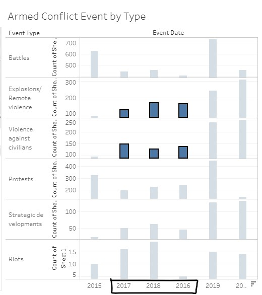
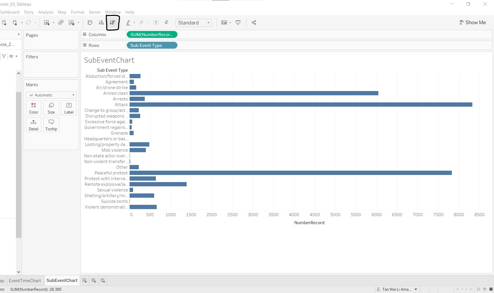
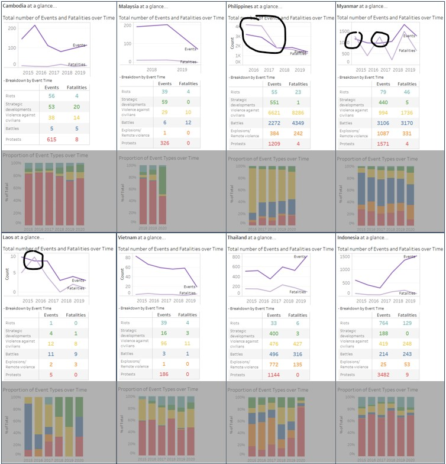

```{r setup, include=FALSE}
knitr::opts_chunk$set(echo = FALSE)
```

# The Data Visualisation

The South-east Asia Armed Conflict Analysis is a data visualisation created to reveal spatio-temporal patterns of armed conflict in selected South-east Asia countries between 2015-2020. The link to the interactive visualisation can be found [here](https://public.tableau.com/views/South-eastAsiaArmedConflictAnalysis/South-eastAsiaArmedConflictAnalysis?:language=en&:display_count=y&:origin=viz_share_link).

{width=120%}

# (a) Critique of current visualisation

There are three evaluation criteria in this critique: (i) clarity; (ii) aesthetics; and (iii) interactivity. Each criterion will be discussed individually, and discussion points that cut across criterion will be placed with the main criterion that it falls under, with highlights on how the other criteria are affected.

## Clarity

### 1) Good choice of chart types

The choice of map to show the location of armed conflict events, encoded by colour and shape to differentiate the different types of armed conflict events, is good as the audience can perceive location together with distance on a map better and other patterns of the data can also surface with the use of the colour and shape scales.

The line graphs are also appropriate to show the trend of armed conflict events over time.

### 2) Unable to see data points clearly when clustered together on the map

In areas with high number and variety of armed conflict events, the data points on the map overlap. As the data points are opaque with no borders, this results in two issues, discussed below.

#### A) Difficulty in identifying the number of data points of the same colour

The main purpose of the map is to show the location of armed conflict events. In locations with high number of events, the map would provide the intensity of events, depicted by the number of data points in the area. As seen from the diagram below, it is difficult to differentiate the data points of the same colour as they form one big mass due to the lack of borders or outlines. This reduces the clarity on the number of armed conflict events happening within the area.

{width=50%}

#### B) Unable to tell if there are any data points (and its colour) covered by the data point at top layer

At the country level (zoomed-out view), the overlapping of the opaque data points causes those data points at the bottom layers to be obscured by the data points at the top layer, as shown in the diagram below. As such, the audience has no clarity on the other types of armed conflict events that occur within the area.

{width=50%}

Another problem that the opaque data point causes is that the audience is unable to tell the name of the area when the data points occur where the names of the area are placed. In the diagram below, the word "Myanmar" could hardly be seen although we could argue that the general public could still make out the word "Myanmar" due to familiarity. However, if we go down to the division/state/region level, one who is not familiar with the Myanmar system would not be able to make out the names of the divisions/states/regions that are fully/partially obscured by the data points, e.g. "Chin" and "Naypyitaw" in the diagram below.

{width=80%}

### 3) Information in map data point tooltip not useful

In the interactive version of the visualisation, a tooltip (see diagram below) is shown when mousing over each data point on the map. The *Event Id Cnty* shows the individual event identifier by number and country acronym; the *Event Type* shows the type of armed conflict event; and the *Latitude* and *Longitude* show the latitude and longitude of the location respectively. The *Event Id Cnty*, *Latitude* and *Longitude* are very specific and too detailed, which does not value-add in the understanding of spatio-temporal patterns of armed conflict in the area.


### 4) Issues with y-axis range in line graphs

The line graphs are small multiples, showing manageable chunks of information in a single view. This makes it clean and easy to view and compare the data patterns. However, the range of each y-axis differs across the different line graphs, and the y-axis does not start at zero. This causes the audience to focus on the patterns and overlook the actual numbers, and misleads the audience into thinking that the patterns give a good representation of the values. To illustrate the point, let us take a closer look at the line graphs for Protests and Strategic developments. 


The number of Protests in 2020 decreased drastically from 2019, whereas the number of Strategic developments has seen a steady increase from past years. The graph patterns seem to indicate that Strategic development has a much higher number of events than Protests, and that the number of Protests is close to zero, but it is not so when we compare the values! In 2020, the number of Protests is about 125-130, and the number of Strategic development events is about 150.

### 5) Order of event types in line graphs not intuitive

At first glance, the order in which the line graphs are arranged vertically is not clear, a result of different ranges in the line graphs as discussed earlier. Upon a closer look, the sort icon in the x-axis indicates that the line graphs are sorted in descending order. However, this is still not apparent from the line graphs themselves, and require the audience to trace the number of events across line graphs in order to understand the sorting.

{width=80%}

### 6) Different data aggregation does not support spatio-temporal analysis

The map view shows the **spatio patterns** of armed conflicts as a **total of the six years**, whereas the line graphs show the **temporal patterns** of the **annual number** of armed conflicts **over the six years**. As the data aggregation is different, the audience is unable to draw the relationship between the spatio pattern and temporal pattern of the data from the visualisation, i.e. cannot tell what is the trend of armed conflict events over time of a specific region of the country.

{width=120%}

## Aesthetics

### 1) Issues with shape encoding on map

There is shape encoding in the map visualisation, however, the size of the data points is too small for the audience to make out the shape unless one scrutinises the data points or has a sharp eye for details. The size of the data points remain unchanged even after zooming in.


From the diagram above, we can see that there is no legend to inform on the shape encoding. It is not clear what is being encoded by the shape. In addition, there is no differentiation in the data point tooltip information for the audience to make a guess at what the shape encodes. This reduces the clarity of the shape aesthetic.

{width=40%}

{width=40%}

### 2) Good amount of non-data ink for the line graphs

There is a good amount of non-data ink for the line graphs, making the design clean and easy to read.

As the graph titles are usually placed at the top or bottom of graphs, the label *Event Type* at the top of the graphs direct the audience to where the title actually is. Putting the graph titles at the side also allows for easier vertical comparison of the data without any visual interruption, but we could also argue that the eye needs to go left and right in order to identify which line graph is for which event type.

{width=80%}

On the other hand, the label *Event Date* may be misleading as only the year component of the event dates are shown in the x-axis. As the x-axis labels are only at the bottom, it is a relatively long distance to trace between the first graph at the top to the x-axis labels to identify the corresponding year for each data point in the line graphs. It would be better if *Event Date* is replaced with year labels repeated  at top. There is no need for the *Year* x-axis title as it will be intuitive that year is being represented on the x-axis with the labels themselves.

{width=80%}

The y-axis titles for the line graphs do not provide value to the audience as it refers to a *Sheet1* that the audience have no idea about and no access to. Furthermore, the y-axis title is orientated vertically and is repeated for each line graph, which makes it hard to read and does not value-add in understanding what the line graphs are plotted against.

{width=80%}

### 3) Colour scale not employed across graphs

The map uses colour to encode the event type (mapping shown in the legend on the right), however the line graph uses the same colour blue as *Battles* in the map, for all the event types. Furthermore, colour perception is more powerful and efficient than reading and understanding textual description, i.e. graph titles. This means that the audience would need to work harder in linking and de-linking colours, and  reading the graph titles, when switching between the map and line graphs.

### 4) Position of colour legend too far from map

As the colour scales are only used in the map, the audience need to trace horizontally across the entire visualisation to refer to the colour legend. The legend should be placed appropriately near to where the colour scale is used for the audience to have easy reference.

## Interactivity

### 1) Different views allowing multi-dimensional analysis

The visualisation shows two different views of the data on screen: map and line graphs. This allows for interaction with the two graphs and easy comparison of data between the two views (though limited, as discussed earlier under point 6 of the clarity criterion). 

### 2) Limited interactive capabilities

Both views provide navigation to view low-level detail (i.e. tooltip information) and selection functions (pointer and drag-box) to highlight data points of interest. There is a filter function to allow analysis of the data by country of interest and users are also able to highlight data by event types. The map view provides basic map interaction such as zoom, pan and added selection functions of radial and lasso selections. The line graphs view has the sorting function, which was discussed earlier under point 5 of the clarity criterion. 

{width=120%}

The features and usability of the interactivity will be discussed in more detail next.

#### A) Added tooltip with drag-box selection not useful for map view

{width=80%}

With the selection of a set of data points, the user is able to mouse over to view the tooltip information of the selected points. The plus point is that there is an option to access the data of the selected data points, and the minus point is that the *SUM of AVG(Longitude)* value does not make any sense for the selected data points.

#### B) Useful information/feature in added tooltip with drag-box selection of a **single year** in line graphs

{width=80%}

Similar to the drag-box selection in the map view, the user is able to view the tooltip information of the selected data points. *SUM of CNT(Sheet1)* field provides the total number of events for the selected data points, which is useful information. The sorting feature is also useful, since it is visually difficult to compare the values and sorting the data would help to see the order. The diagram below shows the output after sorting 2016 data in descending order. 

{width=80%}

The sorted display of the line graphs does not have any indication that the data is sorted should the user remove the selection. To make matters worse, the difference in the y-axis range across the line graphs and the y-axis not starting at zero do not aid the user in perceiving the sorting order (ascending or descending).

#### C) Sorting feature in added tooltip not useful with drag-box selection **across years** in line graphs

If the user wants to find out more on the number of *Explosions/Remote violence* and *Violence against civilians* events between 2016 and 2018, the visualisation allows the selection and displays the sum of the events when mousing over one of the data points.

{width=80%}

The sorting feature is also available, and the output after sorting is shown below.

{width=70%}

This sorting feature and its output create confusion to the user due to the following:

* Chart type changes to a bar chart: data shown is the same, but user is required to switch from perceiving lines graphs to bar graphs
* Year order for the selected years changes: order does not make sense, even when user tries to decipher from the bar graphs. The change is also subtle and might go undetected

In addition, the selection function changes to a radial selection after sorting was done, and there is no option for user to switch to other selection options on the line graphs.

{width=70%}

#### D) Filter feature is flexible

The visualisation allows user to filter the data displayed by all countries or a specific country. The map view corresponds to the filter selection, i.e. the map pans to the country that is being selected. For example, the map view pans to show the entire region when *(All)* is selected. The data in the line graphs also changes, as can be seen by the change in the y-axis range.

{width=120%}

The filter function also allows for filtering by multiple countries, although this requires some exploration on the part of the user. Notice that the map view now pans to show the area that covers the selected countries only.

{width=120%}

The multiple selection of countries is achieved by clicking on the dropdown arrow on the *Country* filter and selecting *Multiple Values (list)*, as shown below. The user can also choose to perform filter by inclusion or exclusion.

{width=40%}

It was observed that the line graphs are designed to show total values by event types based on the country filter. This means that the line graphs do not support comparison of event types across countries, should the user want to compare between countries.

#### E) Highlighting draws attention to selected records

The highlighting feature is useful to view the data points for selected event types, especially in the map view. As seen from the diagram below, selecting *Strategic development* on the *Event Type* colour legend highlights the corresponding data points on the map and the line graph, and the other data are "greyed out". 

{width=120%}

However, as the data points on the map are opaque and overlap with each other, it is difficult to make comparison between event types on the map view (as mentioned earlier under point 2 of the clarity criterion). The following diagram showing the selection of *Battles* and *Strategic development* further reinforces this difficulty.

{width=120%}

Another point to note is that the order of the line graphs and the order of the event type legend are not aligned for *Violence against civilians*, *Protests* and *Riots* event types. This is counter-intuitive to the user in perceiving the sequence of the line graph with reference to the legend, and vice versa.

{width=80%}

### 3) No coordinated highlighting between the two views

Although the visualisation places the map and line graphs side-by-side, the two views are not coordinated. Selecting data points in one view does not highlight the corresponding data points in the other view. The diagram below shows the selection of all the 2016 data points in the line graphs, but the 2016 data points are not highlighted in the map view. 


# (b) Alternative Data Visualisation and Interactive Techniques

In general, the map and line graphs design is retained to show the spatio and temporal patterns of the data. The table lists the changes made to improve the current design and its advantages.


| Issues | Proposed Changes | Advantages|
|--------|------------------|-----------|
||||
| Clarity: Unable to see data points clearly when clustered together on the map <br> Aesthetics: Issues with shape encoding on map | - Proportional symbol map with some degree of transparency <br> - No shape encoding <br><br><br> | - Differentiate data points clearly without obscuring<br> - Able to estimate number of data points based on size <br><br>|
| Clarity: Information in map data point tooltip not useful <br><br><br>| Tooltip to show detailed information such as location (instead of codes, latitude and longitude), trends over time, and breakdown by sub-event type and interaction | - More useful information provided <br> - Allow analysis of data over time <br><br><br>|
| Clarity: Issues with y-axis range in line graphs<br> Clarity: Order of event types in line graphs not intuitive<br> Clarity: Different data aggregation does not support spatio-temporal analysis <br><br>| - Horizontal comparison of line graphs for event types <br> - Countries are plotted within the same event type <br> - Use of log scale in y-axis of line graphs <br><br><br><br> | - Remove the need for ordered plots <br> - Allow comparison across countries and time <br> - Position of legends will be beside relevant graphs <br> - Any differences across event types, countries and time can be seen and compared easily |
| Aesthetics: Colour scale not employed across graphs | - Align use of colour encoding in proportional symbol map and line graphs | - Allow quicker and more intuitive comparison across graphs |
| Interactivity: No coordinated highlighting between the two views <br> Possible interactivity not upfront and requires exploration by user <br><br> | - Line graphs placed below proportional symbol map <br> - Interactive options for each graph to be more upfront <br><br>| - Clear demarcation of the two graphs as separate graphs <br> - Able to know what are the possible interactivity available/useful for the visualisation |

# (c) Final product of proposed visualisation

The proposed visualisation is designed using Tableau and uploaded on Tableau Public. The link can be found [here](https://public.tableau.com/views/DataViz_Makeover_03_Tableau/Dashboard1?:language=en&:display_count=y&publish=yes&:origin=viz_share_link).

# (d) Step-by-step description to prepare the final product

### 1. Import file into Tableau

Upon opening Tableau, click on *More...*, go to the directory containing the data file, select the file and click *Open*.

{width=80%}

### 2. Check variables data type

At the *Data Source* tab, check through the data types of each variable and change the data type where necessary. The table below lists the affected variables.

|Variable|Data Type|
|--------|---------|
|Year| Number to Date|
|Region| String to Geographic Role - Country/Region|
|Admin1| String to Geographic Role - State/Province|
|Admin2| String to Geographic Role - County|
|Admin3| String to Geographic Role - City|
|Location| String to Geographic Role - City|

The following steps were taken to change the data type of **Year**:

1. Go to the icon at the top left corner of the header cell containing the variable **Year**.

{width=80%}

2. Click and select the desired data type, i.e. *Date* for **Year** variable.

{width=80%}

The above steps are repeated for the remaining variables.

### 3. Rename variables

The following variables are renamed for easy understanding:

|Current Variable Name| New Variable Name|
|--------|---------|
|Admin1| State/Province|
|Admin2| County-level|
|Admin3| City-level|

The rename is done by selecting *Rename* under the dropdown arrow at the top right corner of the header cell containing the variable, as shown below.


### 4. Filter to only select data between 2015 and 2020

Keeping to the same range of data as the original visualisation, the filter need to be done at the *Data Source* tab so that the user will not be able to change the year range beyond 2015 to 2020 when interacting with the visualisation. The steps taken are:

1. At the top right corner of the *Data Source* tab, click on *Add*.


2. At the *Edit Data Source Filters* pop-up window, click on *Add...*.

{width=50%}

3. At the *Add Filter* pop-up window, select *Event Date* and click *OK*.

{width=50%}

4. At the *Filter Field [Filter Field [Event Date]]* pop-up window, select *Years* and click *Next >*.

{width=50%}

5. At the *Filter [Year of Event Date]* pop-up window, check the boxes for **2015**, **2016**, **2017**, **2018**, **2019** and **2020**, and click *OK*.

{width=50%}

6. At the *Edit Data Source Filters* window, check the filter added and click *OK*.

{width=50%}

7. Back at the *Data Source* tab, notice that a filter has been added at the top right corner of the screen.


### 5. Prepare the data to create the graphs

After importing and filtering the data, the next step is to prepare the variables needed to create the graphs.

#### A) Create hierarchy for geographic variables

Hierarchy is added for variables with geographic roles. This is done for easy reference to the variables. The steps taken are as follows:

1. Select all variables with geographic roles, right-click and select *Hierarchy/Create Hierarchy...*.

{width=80%}

2. At the pop-up window, enter the name of the hierarhcy, i.e. *Map*, and click *OK*.

{width=80%}

3. Click-and-drag the variables to reorder them in the following order: Region -> Country -> State/Province -> County-level -> City-level -> Location.

{width=80%}

#### B) Create calculated field to count each record row

Instead of using the **Sheet1(Count)** generated by Tableau,we will create a *Calculated Field* to do the same thing and name it appropriately.

1. Click on the black dropdown arrow as shown in screen shot below, and select *Create Calculated Field...*.

{width=50%}

2. A pop-up window will appear. Enter the name *NumberRecord* and the value *1* as shown in the screen shot below and click *OK*.

{width=50%}

### 6. Create the base proportional symbol map

It was found that Tableau does not recognise some **City** and **State/Province** values for some countries, based on the latitude and longitude values generated by Tableau. As such, the map needs to be based on the latitude and longitude values provided in the dataset. The steps taken are as follows:

1. Convert **Latitude** and **Longitude** from *Measures* to *Dimensions*.


2. Click-and-drag **Latitude** to *Rows* and **Longitude** to *Columns*.


3. Click and drag **Event Type** to *Color* and **NumberRecord** to *Size* in the *Marks* card. At the **Event Type** legend, right-click and check that *Highlight Selected Items* option is selected.


4. Click *Size* and resize the circles to be larger, so that users can easily see them.


5. Click *Color* and select *Opacity* to be **60%** and change the *Border* to grey.


Notice that there are some data points being obscured by the larger data points in blue in the screen capture below, due to the sorting order of the event types.

{width=50%}

This can be rectified by changing the sorting order with the following steps:

1. Click on the dropdown arrow beside **Event Type** and select *Sort...*. 


2. At the *Sort [Event Type]* pop-up window, select **Field** under *Sort By* and keep the default values for the other fields.

{width=50%}

Return to the map and notice that data points of the other event types can now be clearly seen.

{width=50%}

### 7. Add another *Marks* layer to the map

The country borders on the map are not clear, especially with data points covering the country border lines. As such, we will add another marks layer to demarcate the map area for each South-east Asian country.

1. Right-click **Country** and select *Add to New Layer*.


2. At the *Marks* card section, click-and-drag **Country** layer to after **Latitude** layer, so that the data points layer will be above the land area layer.


3. At the **Country** *Marks* card, click the dropdown list and select *Map*.


4. Click-and-drag **Country** details to *Color*.


5. As we do not want this second layer to draw attention away from the data points, the colour settings is important. Click on *Color* to adjust the opacity to **2%** and change the border color to white.


6. Under *Edit Color*, the lighter colours from *Superfishel Stone*, *Miller Stone* and *Nuriel Stone* colour palettes are chosen to represent each country. Click each country under *Select Data Item* and the corresponding colour to assign the colour to that country. The final colours chosen are shown below.

{width=50%}

### 8. Add filters to the proportional symbol map

Filters allow user to interact with the map to do their own exploration. In this section, we will add the period range and country filter.

1. Click and drag **Country** to *Filters*.


2. At the *Filter [Country]* pop-up window, click *OK*.

{width=50%}

3. Click and drag **Event Date** to *Filters*.


4. At the *Filter Field [Event Date]* pop-up window, check that *Range of Dates* is selected and click *Next >*.

{width=50%}

5. At the *Filter [Event Date]* pop-up window, click *OK*.


6. At the *Filters* card, click the **Country** dropdown arrow and select *Show Card*. Repeat this step for the other filter **Event Date**.

{width=50%}

After some cosmetic changes such as editing the filter titles, re-ordering the filter cards and removing the legend cards for the count and country, the screen shot below shows the proportional symbol map.


### 9. Customise the tooltip in the proportional symbol map

There are two tooltips to create, one each for the **Latitude** and **Country** mark layers. The **Latitude** layer tooltip will contain information specific to the event type, and latitude and longitude coordinates, whereas the **Country** layer tooltip will contain information at the country level.

#### Tooltip for **Latitude** mark layer

The information to be displayed includes location, number of events over time, breakdown of events by event sub type and interaction. As interaction is a numeric code, there is a need to translate it to text for easy comprehension:

1. Convert **Interaction** to dimension by right-clicking and selecting *Convert to Dimension*.

{width=50%}

2. Edit **Interaction** aliases to display text instead of numbers by selecting *Aliases...* and entering the corresponding text provided in the ACLED codebook [here](https://acleddata.com/resources/general-guides/). Note that the text for code **70** is not provided in the codebook. However, based on the pattern of the coding, it can be derived as civilians acting on their own.

{width=50%}

{width=50%}

Next, we will create the charts for the tooltip.

1. Click on the *New Worksheet* button near the bottom of the screen.


2. Rename the worksheet by double-clicking on the tab name and change it to *EventTimeChart*. Click-and-drag **Year** to *Columns*, and **Event Type** and **NumberRecord** to *Rows*. Under *Show Me* at the right of the screen, select the *lines (continuous)* graph.


3. Right-click the y-axis and select *Edit Axis* to rename the y-axis title.

{width=50%}

4. In the *Edit Axis [NumberRecord]* pop-up window, change the *Title* to **Count**.

{width=50%}

5. Repeat step 11 and 12 for the x-axis, but leave the title blank. At the *Tick Marks* tab, remove the minor tick marks by selecting *None*.

{width=50%}

6. Resize the chart, so that it can fit within the tooltip.

The first chart is done!


7. Create another new worksheet and rename to *SubEventChart*. Click-and-drag **NumberRecord** to *Columns* and **Sub Event Type** to *Rows*. Click on the button shown to sort in descending order.



8. To be consistent with the display of colours for event types, click-and-drag **Event Type** to *Color* in the *Marks* card.


9. Remove the y-axis title by right-clicking on the y-axis and selecting *Hide Field Labels for Rows*.


10. Edit the x-axis title and resize the chart, so that it can fit within the tooltip.

The second chart is done!


11. Create another new worksheet and rename to *InteractionChart*. Click-and-drag **NumberRecord** to *Columns*, **Interaction** to *Rows* and **Event Type** to *Color* in the *Marks* card. Under *Show Me* on the right of the screen, select *stacked bars*. 


12. Click the descending sort button to sort the bars in descending order.

13. Remove the y-axis title, rename the x-axis title and resize accordingly. 

The third and last chart for the **Latitude** layer tooltip is completed!


We can now create the tooltip for the **Latitude** mark layer.

1. Back at the main worksheet, click-and-drag **Event Type**, **Country**, **State/Province**, **Location** and **Year** to *Tooltip* in the **Latitude** marks layer card.


2. Click-and-drag **Interaction**, **Country**, **State/Province**, **Location**, **Sub Event Type**, **Fatalities** and **NumberRecord** to *Detail* in the marks card.


3. Click on *Tooltip* and the *Edit Tooltip* window will appear. Click on *Insert* and select the charts from *Sheets* and the other variables as shown below.


4. The *Edit Tooltip* should look like this:

{width=80%}

The completed tooltip for the **Latitude** layer should look like this:


#### Tooltip for **Country** mark layer

The information to be displayed includes number of events and fatalities over time and by event type and the proportion of event types over the time.

To create the number of events and fatalities chart over time:

1. Create a new worksheet named *EventFatalities* with **Year** in *Columns*, and **Fatalities** and **NumberRecord** in *Rows*. Click on *Show Me* and select *dual lines*.


2. Right-click the secondary axis on the right and select *Synchronize Axis*.


3. To change the colours, click on the dropdown arrow and select *Edit Colors...*.


4. Go to *Tableau Classic 20* and select the colours shown below for **Events** and **Fatalities**.

{width=50%}

5. To label the lines by events or fatalities, click-and-drag **Measure Names** to *Label* in the **All** marks layer.


6. Format the x-axis by right-clicking the x-axis and select *Edit Axis*.


7. Remove the x-axis title by clearing the highlighted text shown below.

{width=50%}

8. Under the *Tick Marks* tab, select *Fixed* and *None* for the major and minor tick marks respectively.

{width=50%}

9. Rename the y-axis title with the same steps and change the title to *Count*.

10. Remove the secondary axis title and labels by right-clicking it and un-selecting *Show Header*.


11. Resize the graph so that it can fit into the tooltip. As the measure names labels are too big, click on *Label* in the **All* marks layer card, change to font size 8 and alignment to Horizontal *Left* and Vertical *Middle*.


The chart is done!


To create the table to show the number of events and fatalities by event type:

1. Create a new worksheet named *TableNumDetails* with **Country** and **Event Type** in *Rows*. Click-and-drag **Fatalities** and **NumberRecord** to the *Abc* column formed in the plot area, as shown below.


2. Right-click the **Country** column in the table and un-select *Show Header* to remove the country labels.


3. Right-click **NumberRecord** and select *Edit Alias...* to rename the column to **Events**.


4. Right-click **Event Type** and select *Hide Field Labels for Rows*.

{width=50%}

5. To make the numbers bigger:
    * Right-click on the table and select *Format*. Click on *Fields* and select *Measure Values*.
{width=50%}
    * Under *Default* *Font*, change to font size 11 and click the boldface.
    * Under *Default* *Alignment*, select Horizontal *Center* and Vertical *Middle*.
    * Under *Default* *Numbers*, go to *Number (Custom)* and change to zero decimal places.
    


6. Again, to be consistent with the use of colours for event types, click-and-drag **Event Type** to *Color* in the *Marks* card.


7. As the order of the event types differ from the main map, right-click **Event Type** and select *Sort*


8. In the *Sort [Event Type]* pop-up window, select *Manual* under *Sort By* and arrange the event types in the order shown below.

{width=50%}

The final table will look like this:


Next, we will create the chart for the proportion of event type over time.

1. Create a new worksheet *PropEventTime* with **Event Type** and **Year** under *Columns*, and **NumberRecord** under *Rows*. Click *Show Me* and select the *stacked bars* graph.


2. Under **SUM(NumberRecord)** dropdown list, go to *Quick Table Calculation* and select *Percent of Total*.


3. Click on the **SUM(NumberRecord)** dropdown list again, go to *Compute Using* and select *Event Type*.


4. Edit the axis titles and resize accordingly. 

5. As the order of the event types differ from the main map, right-click **Event Type** and select *Sort* 


6. In the *Sort [Event Type]* pop-up window, select *Manual* under *Sort By* and arrange the event types in the order shown below.

{width=50%}

The chart is completed!


Now, the tooltip for the **Country* marks layer can be created:

1. Return to the main worksheet and go to the **Country** marks layer card. Click-and-drag **Country** to *Tooltip*.


2. Click on *Tooltip* and make the necessary edits. The *Edit Tooltip* should look like this:


The tooltip for the **Country** layer should look like this:


### 10. Add chart title for clarity

To make it clear to the user that the visualisation is for South-east Asia countries only, it is important to add a title to the visualisation. It would also be helpful for the title to show the user which country and time period are being filtered. As adding the exact dates in the title would add more visual clutter than good information, only the year of the filtered period would be shown. The steps taken to add a dynamic title are:

1. Under the **Location** marks layer, click on **<ATTR(Year)>** and select *Format...* in the menu list that appears.


2. The *Format ATTR(Year)* will appear on the left. Under *Pane*/*Default*, click on *Dates* and select *Custom*. Key in *YYYY* in the format box provided.

{width=50%}

3. Double-click on *Map* and the following pop-up window will appear.


4. The title is edited as shown below. **<ATTR(Country)>** and **<ATTR(Year)>** are added by selecting the corresponding measures under *Insert*.

{width=80%}

The proportional symbol map is done!


### 11. Create the line graphs

1. Create a new worksheet *LineGraph*, and click-and-drag **Event Date** to *Columns* and **NumberRecord** to *Rows*.


2. Click-and-drag **Event Type** to the area between the x-axis title and the plot area until a dotted line appears, as shown in the figure below.


3. Click-and-drag **Country** to *Detail* in the *Marks* card. Click-and-drag **Country** again, but this time to *Color*. Right-click the legend to check that *Highlight Selected Items* option is chosen.


4. To label the lines by the country names, click-and-drag **Country** to *Label* in the *Marks* card.


5. Click on *Label*, *Font* and change the font to size *8* and *boldface*, and select *Match Mark Color*.


The y-axis needs to be changed to log scale due to its wide range making it hard to see the lines near the bottom of the graph. To change the y-axis scale:

1. Right-click the y-axis and select *Edit Axis...*.


2. At the *Edit Axis [NumberRecord]* pop-up window, change the Scale to *Logarithmic* *Symmetric*, and change the Range to *Fixed* with the starting point at *0*. Edit the Axis Title to *Count*.

{width=50%}

Next, let us remove the x-axis title at the top by right-clicking and selecting *Hide Field Labels for Columns*.


To make it easier for the user to match the y-axis value to the graph contents on the right, we will add a dual axis for the same Count with the following steps:

1. Click-and-drag **NumberRecord** to the right of the plot until a dotted line appears.


2. Right-click the y-axis that just appeared and select *Synchronize Axis*.


3. Right-click the secondary y-axis and select *Edit Axis* to rename it to *Count*.


As the years in x-axis is not visible, right-click the x-axis and select *Rotate Label*.


Do formatting and re-sizing as desired, and the base line graph is complete!


### 12. Add chart title and reference lines to the line graphs

To provide more clarity on the chart and median line to the graphs to allow user to make comparisons, let us add a chart title and median reference line to the line graph.

To add chart title, double-click on *LineGraph* and key in *Armed Conflict Event by Type*.


To add reference line:

1. Right-click on any of the y-axis and select *Add Reference Line*.


2. At the *Add Reference Line, Band, or Box* pop-up window, make the following changes as shown in the screen shot below.


The line graph after adding the chart title and median reference line:


### 13. Add the tooltip for the line graphs

Now, the tooltip for the line graphs will be added. It will include information such as the number of events for the event year in that year and what is the proportion that is takes up for that year.

1. Click-and-drag **NumberRecord** to *Tooltip* in the **All** marks card.


2. Click on **SUM(NumberRecord)**, go to *Quick Table Calculation* and select *Percent of Total*.


3. Click on **SUM(NumberRecord)** again, go to *Compute Using* and select *Event Type*.


4. Click on *Tooltip* to open up the *Edit Tooltip* window to edit the contents of the tooltip as shown:


The tooltip is done!


As there are calculations in the tooltip, another table is created to check against the formula of the tooltip, shown below.


### 14. Create the dashboard

Next, we will create the dashboard to join the proportional symbol map, line graphs and other chart elements together.

1. Near the bottom of the screen, click on *New Dashboard*.


2. Next, we need to define the size of the dashboard. As we want to place the graphs vertically beside each other, click on *Fixed size* and select *Custom* under *Size* in the *Dashboard* tab on the left.


3. Edit the *Width* and *Height* to **1300px** first. We can make adjustments later if needed. Notice that a scroll bar appears on the right of the screen.


4. Next, we will add the proportional symbol map to the dashboard by clicking-and-dragging **Map** to the *Drop sheets here* area, as shown below.


5. The proportional symbol map with the filters and legend are shown in the dashboard.


6. Then, we add the line graph. Scroll to the bottom of page, click-and-drag *LineGraph* to the area below the map until a grey horizontal box appears, as shown below.


7. The line graph appears below the map. Note that the legend for the country appears on top beside the map.


We need to check the display of both graphs in the dashboard and make adjustments. At the map view, select a country e.g. Myanmar to check the map display. Notice that there are a lot of space on the left and right sides of Myanmar in the map.


8. Under *Dashboard* *Size*, change the *Height* to **1500px**, and adjust the size of the map so that the Myanmar map is large enough and fills up most of the map view.


On the right column, the period range filter is at the top, which is aesthetically not very pleasing. 

9. Click-and-drag a *Blank* object to the area below the filter until a grey box appears, as shown below.


10. Swop the position of the period range filter and the blank object, and adjust until satisfactory.


Next, we want to make the possible interactions more visible to the user, and inform on the interactions that will affect both the map and line graphs.

11. Click-and-drag a *Vertical* object to the area below the *Country* legend.


12. Notice that a blank box will appear.


13. Next, click-and-drag the **Event Type** legend to the box, as shown below.


14. Then, click-and-drag the **Country** legend to the area within the box that is below the **Event Type** legend, as shown below.


15. To create a border for the vertical object encapsulating both the **Event Type** and **Country** legends, click on the *Layout* tab on the left and select the indicated vertical object under *Item hierarchy*. Notice that the vertical box is selected on the dashboard.


16. Under *Border*, select the filled line.

{width=50%}

Next, we add some prompters to indicate to the user the action that can be taken within the box

17. Click on *Dashboard* tab on the left, and click-and-drag a *Text* object to the top of the vertical box, as shown below.


18. The *Edit Text* window will pop up. Change the text as shown in the screen shot below.

{width=80%}

19. Adjust the position of the elements until satisfactory.

20. Add a floating *Text* object to inform users on the mouse-over tooltip for the country and data points. This floating object is chosen as it can be placed on the map. Edit the text and adjust the formatting and position accordingly.


The final product of the proportional map view and the controls are shown below.


Last, let us add the data source to provide information on the data used. This is done by clicking-and-dragging a *Text* object to the bottom of the dashboard. Do not forget to change back to *Tiled* selection!


Add the text in as shown below, and adjust the size accordingly.

{width=50%}

The second half of the dashboard is now complete!


# (e) Major observations revealed by the final product

### 1. Spatio pattern of events changes over time

From the proportional symbol map from 2015-2020, we can now see which areas has higher number of armed conflict events (size of data points), and we can also discern more clearly the event types (colour of data points).


However, the data is aggregated over the six years. By using the period range slicer to observe the spatio patterns for each year, we can see that the number of events and type of events varies over time for each country. The image below shows the comparison over time for all the countries.


From the above, note that there is no data for Malaysia in 2015 and 2016, and Philippines in 2015. Let us take a closer look at Myanmar. 

In 2015, Myanmar experienced a high number of events, mainly **battles** with some **violence against civilians** in the northern region, and **protests** is peppered throughout the central region. In 2016 and 2017, there are visually less number of events in other parts of the country, except for the northern region. A small cluster could also be seen forming in the western coast. In 2018, there is a slight shift of events within the northern region. In 2019, the numbers picked up again throughout the country with the events concentrated in the western and north-eastern regions. More recently in 2020, the number of **protests** seems to have decreased throughout the country but the western and north-eastern clusters seem to have grown.


Another interesting pattern noted is that of Thailand. Throughout the years, the events are clustered with varying count in two regions: Bangkok and the cities near the Thailand-Malaysia border. We could also see a change in events with more **strategic developments** near the Thailand-Malaysia border in 2016 and 2017, and visually significantly smaller number of events near the Thailand-Malaysia border in 2020. For the rest of the country, the occurrences of **protests** fluctuates from 2015 to 2018 and in 2019, the number of **protests** increased and was spread out. There was also a short appearance of **battles** in the northern-most region in 2019. In 2020, the country faced wide-spread increase in **battles** in most areas.


### 2. Half of the countries fall below the overall south-east asian median for all event types

From the **Armed Conflict Event by Type** graph, the countries can be observed with relative to the overall median. If we highlight an individual country, the country's graphs will be highlighted and the country's median appears, and we can compare this to the overall median. 


From the above, we can see that the country median lines for Malaysia, Laos, Vietnam and Cambodia fall below the overall median lines across all event types.

Let us take a look at the four other countries: Myanmar, Philippines, Indonesia and Thailand.


The median number of events across all event types for both Myanmar and Philippines are higher than the corresponding overall median. For Indonesia, the medians for **strategic developments**, **explosions** and **battles** are below the overall medians, whereas for Thailand, the medians for **riots** and **protests** are below the overall medians.

### 3. Proportion pattern of event type differs across countries

The proportion of event types over time for each country can be observed from the tooltip when the country is moused over on the map. The figure below shows the comparison of the tooltip information for each country, with the focus on the proportion of event types over time.


We can clearly see from the different colours that the patterns observed for each country differs. The pattern for Cambodia, Malaysia and Indonesia are most similar, with a over 50% **protests**. Vietnam's pattern is quite similar, with **protests** taking up about 50-60% and **violence against civilians** taking up the second largest proportion. Two other countries, Philippines and Laos, have significant large proportions of **violence against civilians** too. Overall, the pattern for most countries are consistent over the years, except for Laos. Interestingly, the pattern for Laos changes, with more **battles** in 2015, then **violence against civilians** in 2016-2019, with a substantial proportion of **strategic developments** in 2018-2020.

### 4. Number of events generally higher than fatalities, with some exceptions

In general, most countries experience a higher number of events as compared to number of fatalities. There is also little variation in the number of fatalities, except for three countries: Philippines, Myanmar and Laos. This can be observed from the line graph in the country tooltip, compiled as shown below.



Besides visually significantly different trends for number of fatalities, the above-mentioned three countries have also seen higher number of fatalities than number of events for some periods, as indicated in the figure above. For Philippines, the number of fatalities was higher than number of events in the earlier years and dipped below the number of events in more recent years. Laos also experienced a drop in the number of fatalities in recent years. However, the number of fatalities for Myanmar fluctuated over the years, as seen from the up-down zig-zag pattern.

Looking across the line graphs and the table, we can also see that the Philippines has the highest number of fatalities over the six-year period, followed by Myanmar, Thailand and Indonesia. The number of fatalities for the other countries are relatively low (50 and below). 

### 5. Being 'large' does not mean 'significant'

Let us take a closer look at the Philippines. From the map on the top right in the figure below, we can see that there are three locations that have much larger circles than the rest of the country, indicating these three locations have much higher number of events as compared to the rest of the country. 


Intuitively, one would think that higher number of events hold a more significant role in influencing the country's trend. The number of fatalities of the battles in Marawi (bottom right-most in above figure) contributes about 25% of the total fatalities of **battles** in the country (1,174 of 4,349). However, from the proportion chart in the country tooltip, **violence against civilians** holds the highest proportion of events, indicating that the sum of all the other little events in Philippines contributes more greatly to the country's total number of events.
